# Burro — Design System & Product Specification

> **Burro** — Uzbek tilida so'zlashuvchi bolalar uchun **Arab tilini** o'rgatuvchi mobil ilova. Ikki rejimli: **bola** uchun gamifikatsiyalangan o'rgatuvchi, **ota-ona** uchun monitoring paneli. Duolingo'ning Arabchaga moslashtirilgan, ota-ona hisobi qo'shilgan varianti.

Ushbu hujjat — Burro mahsuloti uchun **dizayn, UX va frontend yagona haqiqat manbai**. U Figma fayldan (UI + Wireframe sahifalari) va ishlayotgan prototipdan (`index.html`) olingan. Har qanday yangi ekran, komponent yoki feature uchun bog'lovchi.

---

## Mundarija

1. [Mahsulot haqida](#1-mahsulot-haqida)
2. [Brand & ovoz](#2-brand--ovoz)
3. [Vizual til (tokens)](#3-vizual-til-tokens)
4. [Typografika](#4-typografika)
5. [Spacing, radius, elevation](#5-spacing-radius-elevation)
6. [Iconography & assets](#6-iconography--assets)
7. [Komponentlar kutubxonasi](#7-komponentlar-kutubxonasi)
8. [Ekran-by-ekran specifikatsiya](#8-ekran-by-ekran-specifikatsiya)
9. [Mood variatsiyalari](#9-mood-variatsiyalari)
10. [Glyph variatsiyalari](#10-glyph-variatsiyalari)
11. [Tweaks paneli](#11-tweaks-paneli)
12. [Motion & animatsiya](#12-motion--animatsiya)
13. [Accessibility](#13-accessibility)
14. [Frontend implementatsiyasi](#14-frontend-implementatsiyasi)
15. [Content qoidalari](#15-content-qoidalari)
16. [Patterns: ✅ qiling / ❌ qilmang](#16-patterns-do--dont)
17. [Ochiq savollar](#17-ochiq-savollar)

---

## 1. Mahsulot haqida

### 1.1 Auditoriya

| Rol | Foydalanuvchi | O'qish darajasi | Qurilma |
|---|---|---|---|
| **Bola (o'rganuvchi)** | 6–14 yosh | Uzbek native, Arabchani noldan | iPhone (ota-onaning) |
| **Ota-ona (admin)** | 25–45 yosh | Uzbek native, biroz Arabcha | iPhone |

UI **ko'p tilli**: O'zbek (Latin) — asosiy; Russian / English / Arabic — alternativ. Til tanlash bayroq chip orqali, Home ekranida o'ng yuqorida. Dars **kontenti** har doim Arabcha — O'zbek tilida tushuntiriladi.

### 1.2 Asosiy vazifalar (jobs to be done)

1. **Bola:** "O'ynayotgandek his qilib Arab alifbosi va dastlabki so'zlarni o'rganay."
2. **Ota-ona:** "Bolam bugun haqiqatan o'qidimi? Qancha vaqt? Qanday yaxshi?"
3. **Ota-ona:** "Yangi hisob ochmasdan ikkinchi farzandimni qo'shay."

### 1.3 Information architecture

```
Splash / Logo
└── Onboarding (til tanlash → rol tanlash → ro'yxatdan o'tish)
    ├── KID app
    │   ├── Home — salom + oxirgi aktivlik + kunlik vazifa + bugungi natija
    │   ├── Modullar — dars kartochkalari (locked / unlocked)
    │   ├── Lesson player — audio → MCQ → speak → result
    │   ├── Tekshirish (review test)
    │   ├── Statistika — haftalik XP grafigi, harf-aniqlik
    │   └── Reyting (leaderboard)
    └── PARENT app
        ├── Home — har bir farzand uchun karta (streak, vaqt, XP, actions)
        ├── Farzandlar (list) → qo'shish / tahrir / o'chirish
        ├── Farzand detail (Statistika, Reyting, Eslatmalar)
        └── Sozlamalar (til, chiqish)
```

### 1.4 Asosiy user flows (har bir prototipda end-to-end ishlashi kerak)

- **Birinchi ochilish:** til tanlash → "Men ota-onaman / bolaman" → ota-ona ro'yxatdan o'tish → birinchi farzandni qo'shish → telefonni bolaga berish
- **Kunlik o'rganish loop (bola):** Home → "Davom etish" → 4–10 savolli dars → Result (XP + aniqlik) → Home (streak +1)
- **Ota-ona check-in:** Home → farzand karta → Statistika → haftalik bar chart va savol-savol breakdown
- **Farzand qo'shish:** Parent Home → "+" → "Farzand qo'shish" form (ism, sinf, jinsi) → tasdiqlash

---

## 2. Brand & ovoz

### 2.1 Nom va logo

**Burro.** Logo — ko'k-cyan gradient doirada ikki bo'g'imli oq shakl (stylize qilingan ع / ج harflari kabi). Hozirgi SVG'ni qayta ishlating; qayta chizmang.

### 2.2 Ovoz

- **Iliq, dalda beruvchi, ikkinchi shaxsda.** "Ajoyib!", "Davom etish", "Sen qila olasan!"
- **Qisqa.** Ko'pchilik string 1–4 so'z. Tugmalar — fe'llar.
- **Hech qachon kamsitmaydi.** Bolalar pastdan gapirilganini sezadi.
- **Ikki tilga hurmat.** Arabcha kontent har doim to'g'ri Arabcha typografika (Scheherazade) bilan; transliteratsiya — yordamchi.

### 2.3 Tagline

> "Arab tilini noldan boshlab, oson va qiziqarli o'rganing."

---

## 3. Vizual til (tokens)

Estetika: **chuqur navy + to'yingan ko'k + yashil/qizil feedback**, navy yoki photographic fon ustida muloyim inset-shadow oq kartalar. Iliq va tactile — biroz skeuomorphic (raised tugmalar, layered shadow), lekin cartoony emas.

### 3.1 Color tokens

```css
:root {
  /* Surface — fonlar */
  --bg-deep:        rgb(14, 26, 69);    /* asosiy app foni, navy */
  --bg-deep-2:      rgb(14, 31, 75);    /* ikkilamchi navy */
  --bg-overlay:     rgba(0, 0, 0, 0.5); /* foto overlay */
  --bg-card:        rgb(255, 255, 255); /* oq karta */
  --bg-card-soft:   rgb(251, 251, 251);
  --bg-muted:       rgb(243, 244, 246); /* gray-100 */
  --bg-muted-2:     rgb(249, 250, 251); /* gray-50 */

  /* Brand */
  --brand-cyan:     rgb(18, 183, 229);
  --brand-blue:     rgb(14, 109, 229);
  --brand-blue-shadow: rgba(18, 183, 229, 0.44);
  --brand-blue-deep: rgb(11, 79, 164);

  /* Status */
  --success:        rgb(41, 173, 57);
  --success-deep:   rgb(19, 109, 60);
  --warning:        rgb(251, 191, 36);
  --danger:         rgb(239, 68, 68);

  /* Text */
  --text-primary:   rgb(17, 24, 39);
  --text-secondary: rgb(107, 114, 128);
  --text-tertiary:  rgb(156, 163, 175);
  --text-on-dark:   rgb(255, 255, 255);
  --text-on-dark-2: rgba(255, 255, 255, 0.7);

  /* Borders */
  --border:         rgb(229, 231, 235);
  --border-soft:    rgb(241, 241, 241);

  /* Shadows */
  --shadow-card:    0 2px 0 0 rgb(172, 173, 176),
                    inset 0 0 6px 0 rgba(255, 255, 255, 0.63);
  --shadow-cta:     0 4px 0 0 var(--brand-blue-deep),
                    0 8px 24px -4px var(--brand-blue-shadow);
  --shadow-soft:    0 1px 2px rgba(0, 0, 0, 0.05);
}
```

### 3.2 Color qoidalari

- **Navy `--bg-deep` — asosiy app foni**, har joyda. Oq fon emas — oq faqat kartalar uchun.
- **Lesson player'da photographic mosque-pattern foni** (`assets/mosque-bg.jpg`) navy ustida overlay sifatida. Yangi fon san'ati yaratmang.
- **`--brand-blue → --brand-cyan` gradient** — imzo. Faqat logo va birlamchi CTA pill uchun. Mayda UI'da flat fill sifatida ishlatmang.
- **`--success`** — faqat positive feedback uchun (to'g'ri javob, streak, kunlik mukofot). Neutral CTA uchun emas.
- **`--danger`** — faqat negative feedback va destructive action (farzandni o'chirish, chiqish tasdiqi). Brand color sifatida hech qachon emas.

---

## 4. Typografika

| Rol | Family | Weight | Size | Line | Eslatma |
|---|---|---|---|---|---|
| Display (logo) | Segoe UI | 700 | 28 | 1.2 | "Burro" wordmark |
| H1 — screen title | Segoe UI | 700 | 20 | 1.2 | "Modullar", "Statistika" |
| H2 — card title | Segoe UI | 700 | 18 | 1.2 | "Oxirgi aktivlik" |
| H3 — row title | Segoe UI | 700 | 16 | 1.25 | List items |
| Body | Segoe UI | 400 | 14 | 1.5 | Tavsiflar |
| Body-strong | Segoe UI | 600 | 16 | 1.4 | Body emphasis |
| Caption | Segoe UI | 400 | 12 | 1.4 | Meta, vaqtlar |
| Numeric (XP, ball) | Tahoma | 700 | 30 / 20 | 1.0 | Stat readouts |
| Arabic content | Scheherazade | 700 | 128 (lesson) / 56 (review) | 1.0 | Harf kartalari |

### 4.1 Web fallback stack

```css
--font-sans:    "Segoe UI", "Inter", system-ui, -apple-system, sans-serif;
--font-numeric: "Tahoma", "Segoe UI", system-ui, sans-serif;
--font-arabic:  "Scheherazade New", "Amiri", "Times New Roman", serif;
```

### 4.2 Arabic qoidalari

- Arabcha kontent **faqat o'z span'ida** RTL bo'ladi: `<span dir="rtl">…</span>`. Page'ni RTL qilmang.
- Arabcha glyph — birlamchi; transliteratsiya (e.g. "Jeem") — 60% kichikroq, gray, ostida.
- Har bir Arabcha glyph yoki so'z uchun **audio majburiy**.

### 4.3 Weight ishlatish

Burro faqat **400 / 600 / 700** ishlatadi. 500 yoki 800 — yo'q. Bu tipografika muvozanatini saqlaydi.

---

## 5. Spacing, radius, elevation

### 5.1 Spacing grid

**4 / 8 / 12 / 16 / 20 / 24 / 32** — qattiq grid. Karta padding deyarli har doim **16** yoki **20**. Card-to-card gap — tight list'da **8**, hero stack'da **16**. **Hech qachon 13, 17, 21 — yo'q.**

### 5.2 Border radius

| Token | Qiymat | Ishlatilishi |
|---|---|---|
| `--r-pill` | 58px | Home top "greeting" pill; birlamchi CTA |
| `--r-card` | 20px | Barcha oq kartalar |
| `--r-chip` | 12px | Stat tile, til chip |
| `--r-button` | 14px | Aksariyat tugmalar |
| `--r-circle` | 50% | Avatar, icon well |

### 5.3 Elevation — 3 qatlamli model

**Page → Card → Action.** Kartalarda muloyim inset highlight + 2px qattiq pastki shadow (Home greeting pill'dagi "raised pill" effekti). Birlamchi CTA — ranglangan glow qo'shadi. Yangi shadow recipe yaratmang — yuqoridagi 3'tadan birini tanlang.

```
Layer 0 — Page          → bg + photographic overlay (no shadow)
Layer 1 — Card          → --shadow-card (inset highlight + 2px ground)
Layer 2 — Primary CTA   → --shadow-cta (ground + colored glow)
```

---

## 6. Iconography & assets

### 6.1 Icon kutubxonasi

- **Boxicons solid** (`bxs-*`) — butun app bo'ylab. Ishlatilayotganlar:
  - `bxs-home` — Asosiy tab
  - `bxs-bell` — Eslatmalar
  - `bxs-pie-chart-alt-2` — Statistika
  - `bxs-user-check`, `bxs-user-detail` — Farzand
  - `bxs-edit-alt` — Tahrir
  - `bxs-exit` — Chiqish
  - `bxs-check-circle`, `bxs-info-circle` — Status
  - `bxs-time` — Vaqt
  - `bxs-book-reader` — O'qish
  - `bxs-down-arrow`, `bxs-chevron-down`, `bxs-left-arrow-alt` — Navigation
- **Streak fire** — `mdi:fire` faqat `--warning` rangida. Bu ikon **muqaddas**: faqat streak counter yonida ko'rinadi.

### 6.2 Icon o'lchamlari

- **24px** — bottom nav
- **20px** — list row
- **16px** — inline (text bilan birga)

### 6.3 Avatar

- **Circular**, 44–92px.
- Mavjud illustratsiyalangan avatar to'plamidan (`/UI/.../assets/`) — bolalar uchun **hech qachon foto avatar emas**.
- 92px — onboarding "Farzand qo'shish" form'da.
- 64px — ota-ona Home'da farzand kartochkasida.
- 44px — Kid Home greeting pill'da.

### 6.4 Flag chip

Mamlakat bayrog'i 32×32 rounded rectangle ichida + dropdown chevron. UI tilini bildiradi. Kid Home top-right'da.

### 6.5 Mosque background

`assets/mosque-bg.jpg` — Lesson player va Home fon overlay'i. **Qayta chizilmaydi.** Figma'dan to'g'ridan-to'g'ri olinadi.

---

## 7. Komponentlar kutubxonasi

Bu komponentlar Figma faylda mavjud. **Qayta foydalaning, paralel yaratmang.**

### 7.1 Foundation

| Komponent | Figma ID | O'lcham | Tavsif |
|---|---|---|---|
| **StatusBar** | `DarkModeFalseTypeDefault2` | 402×44 | iOS status bar. Har doim yuqorida. |
| **BottomNav** | `Property1Default6` | 386×98 | 5 tab: Asosiy, Modullar, **Boshlash** (markazda, 1.4× kattaroq, brand-blue circle), Statistika, Profil. Markaz nav'ning yuqori qirrasidan chiqib turadi. |
| **Header** | `header` | 402×44 | Chap — back, markaz — title, o'ng — optional action. |

### 7.2 Cards

| Komponent | Tavsif |
|---|---|
| **GreetingCard** | Home top pill (radius 58). Avatar + "Hello, {name}!" + streak qatori + til chip. Kid Home va Parent farzand kartochkasida. |
| **ActivityCard** | Rangli karta (yashil — in progress, navy — default). Title, subtitle, progress bar, vaqt-qoldi hint, primary action pastki-chapda. ~160px. |
| **QuestCard** | Navy karta. Chap — title block, o'ng — mukofot chip ("+20 XP"). 64–88px. |
| **StatTile** | Mayda oq tile — yuqorida label, pastda katta numeric. 2 yoki 3 column grid'da (Result, Parent home). |
| **LessonRow** | Modullar list row: rounded square thumbnail (64) + title + subtitle + progress dot/percentage + lock icon. 80px. |

### 7.3 Inputs & buttons

| Komponent | States | Spec |
|---|---|---|
| **PrimaryButton** | default → press | Pill, brand-blue→cyan gradient, oq matn 16/700, height 56, radius 28. Press'da `translateY(-2px)`, ground shadow yo'qoladi. |
| **SecondaryButton** | default → press | Oq fill, brand-blue matn, xuddi shu o'lchamlar. |
| **AnswerChip** | default → selected → correct → wrong | Oq pill, 16/700, height 48, radius 14, 2px hard shadow. State o'zgarishi 150ms color crossfade. |
| **TextField** | empty → focus → filled → error | Oq fill, radius 14, height 48, leading icon, 12/400 placeholder. |
| **Toggle** | off / on | iOS style, on'da brand-blue. |
| **HeartCounter** | full / decrementing | Heart icon + "× N". Noto'g'ri javobda N kamayadi. Lesson top'da. |

### 7.4 Feedback

| Komponent | Trigger | Spec |
|---|---|---|
| **ResultBanner** | Lesson tugadi | Yashil check doirada, "Modul tugatildi!" / "Ajoyib!", 2 stat tile ostida ("20 XP", "85%"). |
| **Toast / inline error** | Validation | 12/400, `--danger` matn, fonsiz. |
| **ConfirmDialog** | Logout, delete | Oq karta 320px, alert triangle, title, body, 2 tugma: "Yo'q" (secondary) / "Ha" (primary). |

### 7.5 Charts

| Komponent | Spec |
|---|---|
| **WeeklyBarChart** | 7 navy bar oq karta ustida; bugungi bar — `--brand-cyan`. Y-axis label o'ng-yuqorida ("XP"), x-axis — Du–Yak. 200px. Gridline yo'q. |
| **AccuracyDial** | Katta numeric percent (90%) "Umumiy natija" label ustida. Ring chart **yo'q** — raqam o'zi chart. |

### 7.6 Empty / loading

- **Bo'sh list:** markazlashtirilgan illustratsiya placeholder (soft-gray rounded square 120×120) + 14/400 muted matn + "Add" tugma.
- **Loading:** skeleton `--bg-muted` block, 1.2s opacity pulse. **Spinner kartalarda yo'q** — faqat full-screen route change'larda.

---

## 8. Ekran-by-ekran specifikatsiya

Har bir ekran prototipdan olingan **screenshot bilan**. Qaysi komponent qaysi joyda — to'liq breakdown.

### 8.1 Kid Home (`Asosiy`)

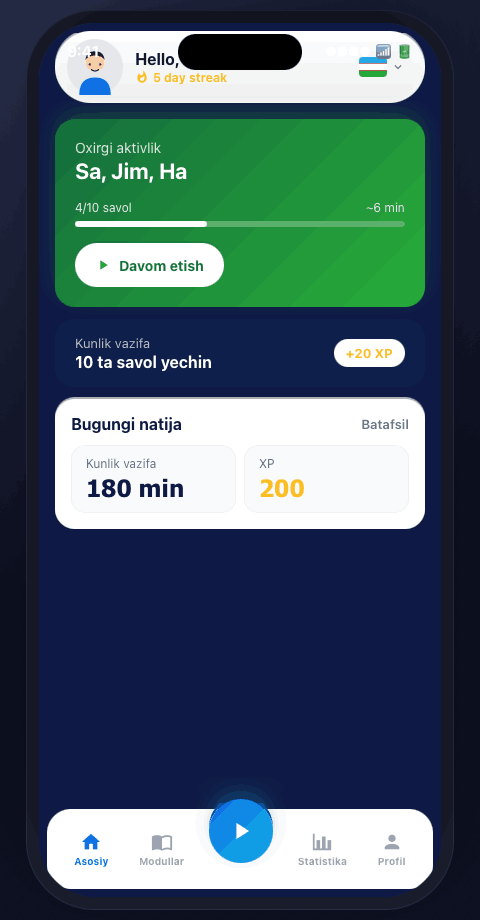

**Tarkibiy qismlar (yuqoridan pastga):**

1. **iOS status bar** — 9:41, signal, wifi, batareya. 44px.
2. **GreetingCard** (radius 58, height ~72)
   - Chap: 44px avatar (illustratsiya).
   - Markaz: "Hello, {name}!" (16/700 navy) + "5 day streak" (12/700, `--warning` rangida, fire icon).
   - O'ng: 32×32 bayroq chip + chevron.
3. **ActivityCard** (yashil, "in progress" state)
   - Title: "Oxirgi aktivlik" (12/600, oq 70%)
   - Subtitle: "Sa, Jim, Ha" (20/700, oq) — oxirgi darslar
   - Progress bar: 4/10 savol, ~6 min qoldi
   - Pastki-chap: "Davom etish" SecondaryButton (oq, brand-blue matn)
4. **QuestCard** (navy)
   - Chap: "Kunlik vazifa" / "10 ta savol yeching"
   - O'ng: "+20 XP" chip (oq fill, brand-warning matn)
5. **Stats card** ("Bugungi natija")
   - Title 16/700 + "Batafsil" link (12/600, navy)
   - 2 ta StatTile: "Kunlik vazifa: 180 min" / "XP: 200"
6. **BottomNav** — Asosiy (active), Modullar, Boshlash (raised), Statistika, Profil

**O'lchamlar:**
- Chetdan padding: 16
- Card-to-card gap: 8 (Quest ↔ Stats), 16 (Activity ↔ Quest)
- Greeting pill chetdan 8px

### 8.2 Modullar (lesson list)

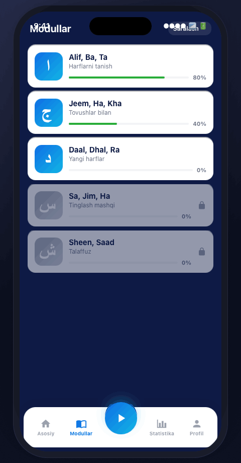

**Tarkibiy qismlar:**

1. **Header** — title "Modullar" (20/700 oq), markazda
2. **LessonRow ×5** (modul kartochkalari)
   - Chap: 64×56 rounded square. Brand gradient + Arabic glyph (oq, Scheherazade 36px) — yoki gray, agar locked.
   - O'rta: title (16/700) + subtitle (12/400 muted) + mini progress bar
   - O'ng: progress percentage (12/600) yoki lock icon
   - Faol modul: brand-cyan border-left
3. Hech qaysi card hover/active emas, lekin tap'da press-lift animatsiyasi (translateY -2px)

**Lock state:** Glyph tile gray gradient, title/subtitle 50% opacity, lock icon `bxs-lock-alt` o'rng tomonda.

### 8.3 Lesson player (savol ekrani)


**Tarkibiy qismlar (yuqoridan pastga):**

1. **Top bar** (12px padding)
   - Chap: × close icon (26px oq)
   - Markaz: progress bar (10px height, `--brand-cyan` fill)
   - O'ng: HeartCounter (heart 18px qizil + "3")
2. **Question card** (oq, radius 20, padding 20, min-height 380, shadow-card)
   - Top: prompt — "Qaysi tovush to'g'ri keladi?" (15/700 muted, markazda)
   - Markaz: **Arabic glyph** ج (130px Scheherazade 700 navy)
   - Pastida: 56px audio button (brand gradient circle, speaker icon oq)
3. **Answer chips** — 2×2 grid, gap 8
   - 4 ta AnswerChip: "Jeem" / "Ja" / "Ha" / "Kha"
   - Default: oq fill, navy matn, gray border
4. **Bottom CTA** — PrimaryButton "Tekshirish" (full width, height 56, fixed bottom 16px from edge)

**Background:** Mosque pattern + navy 85% overlay.

#### 8.3.1 To'g'ri javob state

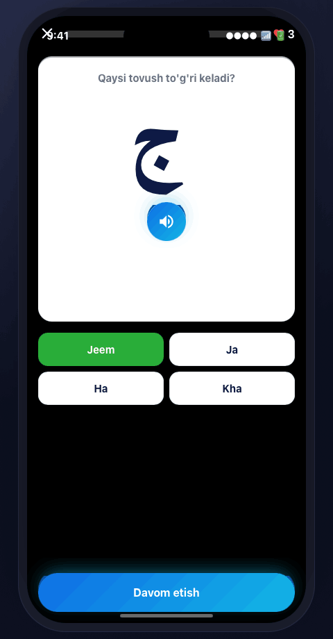

- Tanlangan **to'g'ri** chip → yashil fill (`--success`), oq matn, border yo'q.
- Boshqa chip'lar disabled, lekin oq qoladi.
- CTA matni — "Davom etish".
- 200ms crossfade animatsiya.

#### 8.3.2 Noto'g'ri javob state

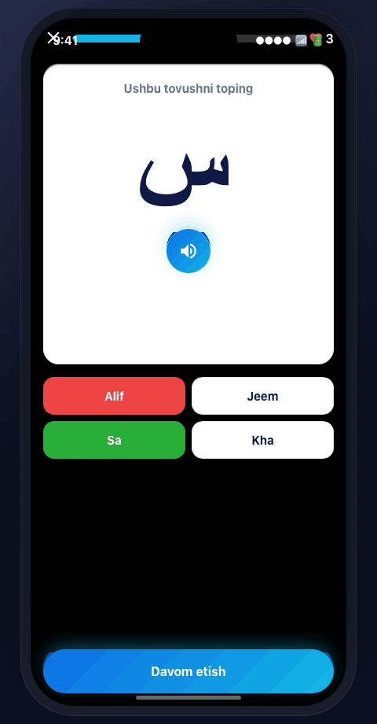

- Tanlangan **noto'g'ri** chip → qizil fill (`--danger`), oq matn.
- **To'g'ri** chip ham yashil fill bilan ko'rsatiladi (kid o'rganadi).
- HeartCounter dekrementiga olib keladi (keyingi savolga o'tganda −1).
- CTA matni — "Davom etish" (qayta urinish yo'q, oldinga ketamiz).

### 8.4 Result ekrani

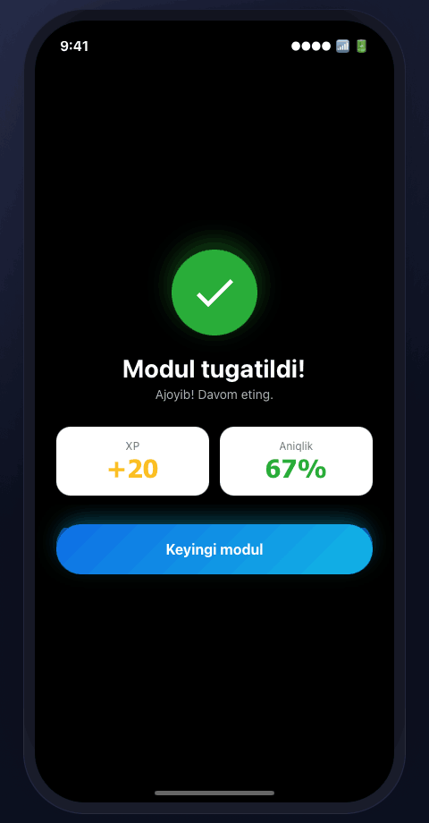

**Tarkibiy qismlar:**

1. **ResultBanner** — yashil check circle (64px), "Ajoyib!" yoki "Modul tugatildi!" (24/700 oq)
2. **Stat tiles** — 2 ta yonma-yon
   - "+20 XP" (Tahoma 30/700, warning rangida)
   - "85%" — aniqlik (Tahoma 30/700, oq) + "Aniqlik" label
3. **Bottom CTA** — "Keyingi modul" (PrimaryButton, full)

**Background:** Mosque + navy overlay (lesson screen davomi).

**Spring animatsiya:** Banner pastdan 350ms spring(240, 18) bilan ko'tariladi.

### 8.5 Statistika

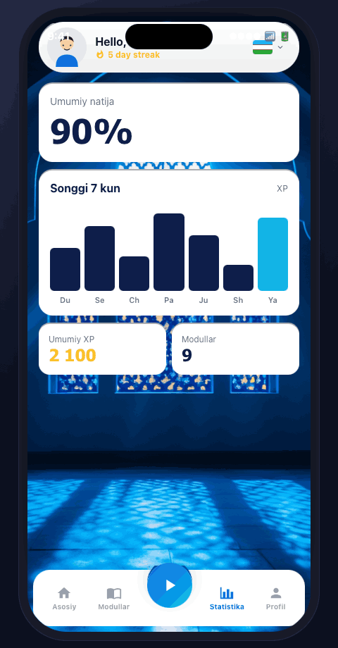

**Tarkibiy qismlar:**

1. **AccuracyDial** — katta "% — Umumiy natija" (Tahoma 30/700)
2. **WeeklyBarChart** — oq karta, 7 bar
   - Y-axis label "XP" o'ng-yuqorida (12/400 muted)
   - X-axis: Du, Se, Ch, Pa, Ju, Sh, Yak
   - Bugungi bar — `--brand-cyan`; qolganlari — `--bg-deep`
   - Bar tepasida qiymat (12/600 navy)
3. **Stats grid** — 2×2 yoki 3 ta StatTile
   - "Jami XP", "O'rtacha vaqt/kun", "Streak"

### 8.6 Profil

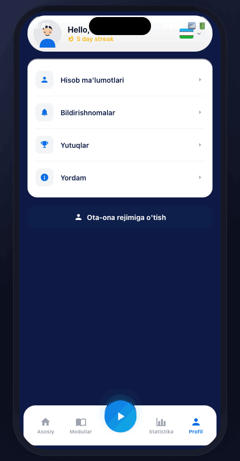

**Tarkibiy qismlar:**

1. **GreetingCard** (Home bilan bir xil, lekin streak ko'rinadi)
2. **List ettings** (oq karta, har biri 56px row)
   - Statistika → Batafsil
   - Farzandlar → 2 ta
   - Ilova tili → O'zbek
   - Eslatmalar → toggle
3. **PrimaryButton** "Ota-ona rejimiga o'tish" (full, brand gradient)

Tap "Ota-ona rejimiga o'tish" → Parent app'ga o'tadi.

### 8.7 Parent Home

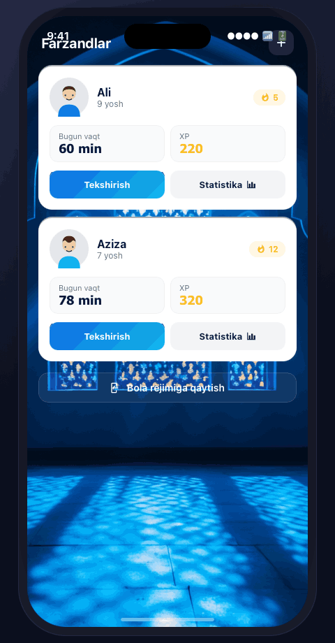

**Tarkibiy qismlar:**

1. **Header** — "Farzandlar" (20/700 oq) + "+" tugma (o'ng, 44×44 brand circle)
2. **Child cards** (har bir farzand uchun, 1 yoki 2 ta)
   - 64px avatar
   - Ism (16/700) + sinf (12/400 muted)
   - 3 ta inline stat: streak (fire + raqam), bugungi vaqt, jami XP
   - Action row: "Statistika" / "Tahrir" / "Eslatmalar" (kichik chip tugmalar)
3. **Settings link** ("Sozlamalar" → til, chiqish)

#### 8.7.1 Farzand qo'shish form

```
Farzand qo'shish
[ avatar selector — 92px circle + ✏ tahrir ]

Farzand nomi
[Nomni kiriting             ] (TextField, leading user-check icon)

Sinfi
[Kiriting                   ] (TextField, leading book icon)

Jinsi
[Tanlang                  ▾ ] (Select, leading user-detail icon)
                              → bottom sheet: O'g'il bola / Qiz bola

[ Saqlash ] (PrimaryButton, full)
```

#### 8.7.2 Logout dialog

```
┌──────────────────────────┐
│ Ehtiyot bo'ling!      ✕ │
│                          │
│        ⚠️ (warning)       │
│                          │
│ Haqiqatdan ilovadan      │
│ chiqishni xohlaysizmi?   │
│                          │
│ "Ha, chiqish" ni bosib   │
│ tasdiqlang.              │
│                          │
│ [ Yo'q ] [ Ha, chiqish ]│
└──────────────────────────┘
```

ConfirmDialog komponenti. "Ha, chiqish" — qizil PrimaryButton.

---

## 9. Mood variatsiyalari

Burro **4 ta mood** qo'llab-quvvatlaydi. Mood — butun palitra + fon sahnasini almashtiradi. Tweaks paneli orqali real-time switch.

### 9.1 Mosque (default)


- **Background:** photographic mosque-pattern + navy 95% overlay
- **Surface:** oq kartalar
- **Accent:** brand-blue → cyan gradient
- **Text on dark:** oq

Eng ko'p ishlatiladigan, default. Diniy/madaniy nuance saqlanadi.

### 9.2 Daylight

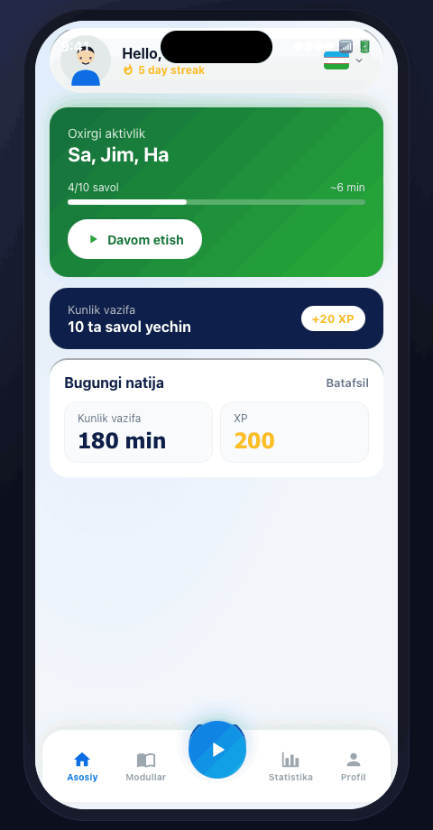

- **Background:** `radial-gradient(at 20% 0%, #DCEAFB 0%, #F2F6FB 60%)` — och osmon
- **Surface:** oq kartalar
- **Accent:** chuqurroq blue (`#0E6DE5`) → cyan
- **Text on dark:** navy (chunki fon yorug')

Kun davomida ishlatish, batareya tejash.

### 9.3 Midnight

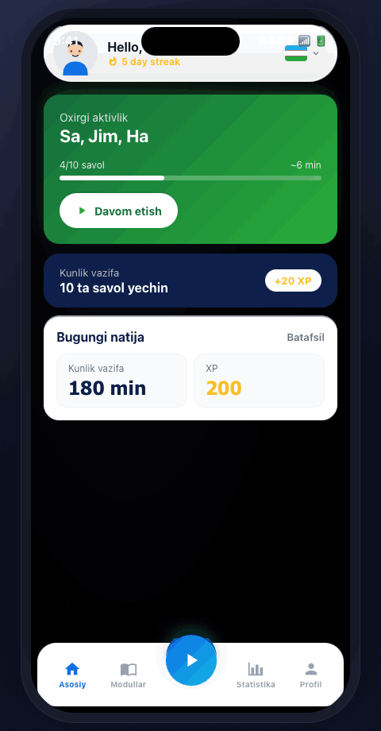

- **Background:** to'liq qora (`#000`) + radial #0a0a14
- **Surface:** `#11111A` qora kartalar
- **Accent:** cyan (`#00E5FF`) → magenta (`#B100FF`) neon gradient
- **Text:** oq

OLED telefonlar uchun, kechqurun ishlatish. Neon urg'u.

### 9.4 Playground

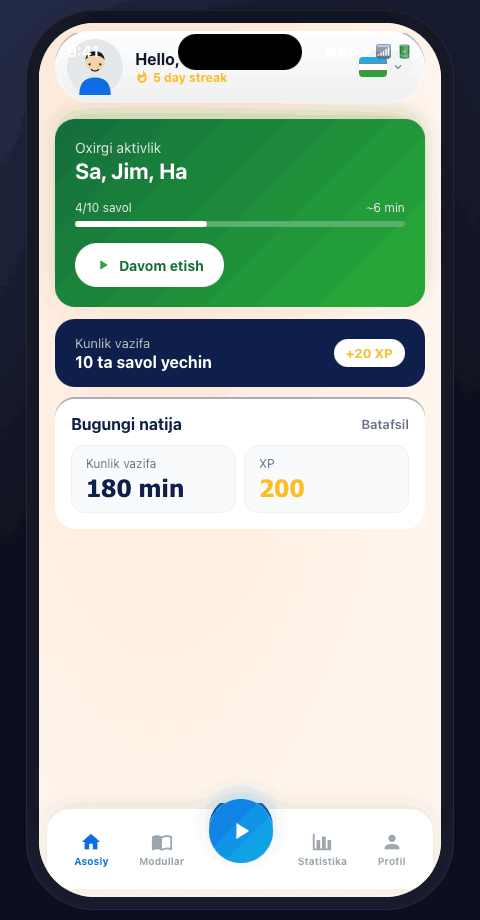

- **Background:** iliq krem (`#FFF5EC` + radial `#FFE3D2`)
- **Surface:** oq kartalar
- **Accent:** korall (`#FF6B4A`) → orange (`#FFB347`)
- **Text:** issiq qora-jigarrang (`#3B1F0F`)

Yoshroq bolalar uchun (6–9 yosh) — yumshoqroq, o'yinchoqroq.

---

## 10. Glyph variatsiyalari

Arabcha harf nasildaging chiziladi — 3 ta uslub, **lesson screen va modul kartochkalarida** ko'rinadi.

### 10.1 Classical (default)


```css
{
  fontFamily: "Scheherazade New",
  fontWeight: 700,
  color: var(--bg-deep),
}
```

An'anaviy serif arabcha typografika. Maxraj o'qishga eng yaqin.

### 10.2 Modern

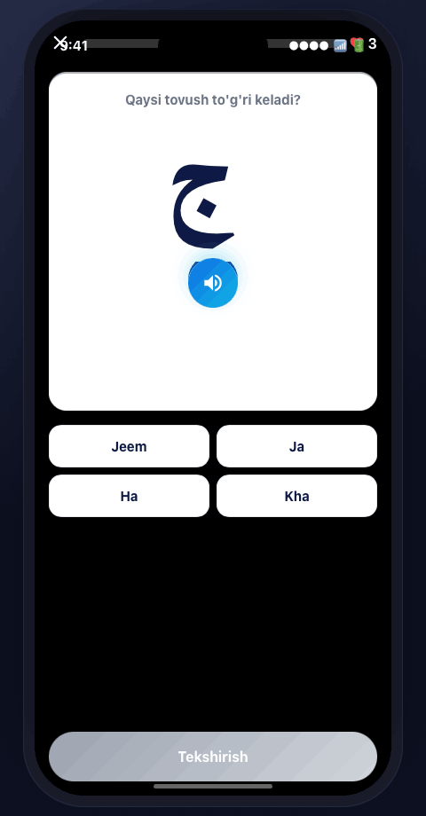

```css
{
  fontFamily: system-ui,
  fontWeight: 300,
  color: transparent,
  WebkitTextStroke: "1px var(--bg-deep)",
}
```

Outlined, sans, light. Brand-forward, app'larda zamonaviy his.

### 10.3 Sticker

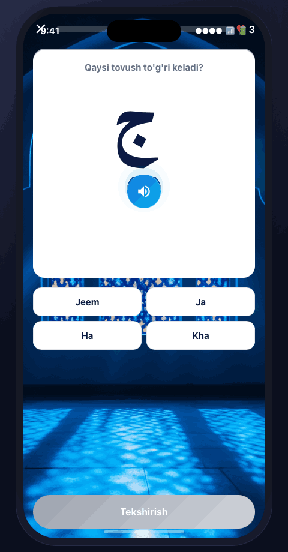

```css
{
  fontFamily: "Scheherazade New",
  fontWeight: 700,
  background: linear-gradient(180deg, #FFD56B 0%, #FF6B4A 60%, #B5371F 100%),
  WebkitBackgroundClip: text,
  textShadow: "0 4px 0 rgba(0,0,0,.18), 0 8px 16px rgba(0,0,0,.25)",
}
```

3D extruded sticker effekti. Yoshroq bolalar uchun, o'yinchoq tuyg'u.

---

## 11. Tweaks paneli

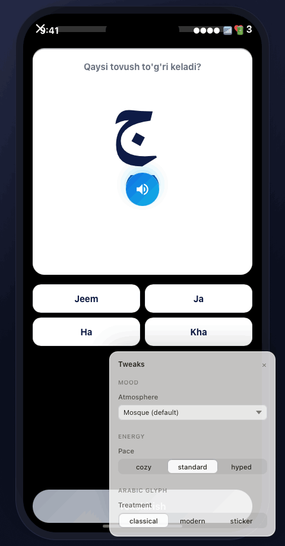

Toolbar'dagi "Tweaks" toggle yoqilganda ko'rinadi. 3 ta nazorat:

### 11.1 Mood (Atmosphere)

- **Type:** Select dropdown
- **Options:** Mosque (default) / Daylight / Midnight neon / Playground
- **Effect:** §9 dagi 4 ta mood

### 11.2 Energy (Pace)

- **Type:** Radio segment
- **Options:** cozy / standard / hyped
- **Effect:**
  - `cozy` — padding 24px, gap 14, animation 320ms (cubic-bezier(.4,0,.2,1))
  - `standard` — padding 16, gap 8, 200ms (default)
  - `hyped` — padding 12, gap 6, 140ms spring (cubic-bezier(.34,1.56,.64,1))

### 11.3 Arabic glyph (Treatment)

- **Type:** Radio segment
- **Options:** classical / modern / sticker
- **Effect:** §10 dagi 3 ta glyph treatment

**Persist:** Tweak qiymatlari `EDITMODE-BEGIN…END` block'da saqlanadi va sahifani qayta yuklashda qaytarib olinadi.

---

## 12. Motion & animatsiya

Burro — **xotirjam + javob beruvchi**, jiltirashmasdan. 3 ta motion pattern app'ning 90% ni qoplaydi.

| Pattern | Davomiyligi | Easing | Ishlatilishi |
|---|---|---|---|
| **Press lift** | 120ms | `cubic-bezier(.2,.8,.2,1)` | Tugmalar, kartalar tap'da |
| **Crossfade + shift** | 200ms | `ease-out` | AnswerChip state, screen transitions |
| **Spring pop** | 350ms | spring(stiffness 240, damping 18) | Streak inkriment, XP +20 toast, ResultBanner reveal |

### 12.1 Reduced motion

`prefers-reduced-motion: reduce` har doim hurmat qilinadi — spring pop'lar 100ms fade'ga aylanadi, parallax/shimmer to'xtaydi.

### 12.2 Energy bilan o'zaro ta'siri

Tweaks panelidagi **Energy** sozlamasi har bir motion qiymatini qayta yozadi:
- `cozy` — barcha duration ×1.6
- `standard` — default
- `hyped` — duration ×0.7 + spring overshoot

---

## 13. Accessibility

### 13.1 Contrast

- Oq `--bg-deep` ustida — **14.6:1** ✅
- Brand-blue oq ustida — **4.7:1** ✅
- **`--text-tertiary` oq ustida — 2.7:1** ❌ — faqat dekorativ meta uchun, hech qachon load-bearing

### 13.2 Hit target

- **44×44 minimum** — barcha tappable surface
- **64×64** — bottom-nav markazi (Boshlash)

### 13.3 Audio + caption

Audio-first dars **majburiy** matn alternative bilan keladi. Har bir "tinglang va tanlang" savolida `bxs-info-circle` toggle ostida caption mavjud — eshitish qiyinchiligi bo'lgan o'rganuvchilar uchun.

### 13.4 RTL

Arabcha kontent o'z block'i ichida RTL. **UI chrome — har doim LTR**, hatto Arabic localization'da. Faqat content flip qilinadi, chrome emas.

### 13.5 Til switcher

Home'dan ≤ 1 tap'da yetilishi kerak. Hozir bayroq chip'da — bu shart saqlanadi.

---

## 14. Frontend implementatsiyasi

### 14.1 Stack

| Concern | Tanlov |
|---|---|
| Framework | **React + Vite** (prototip), React Native (Expo) — production |
| Til | TypeScript, `strict: true` |
| Style | CSS variables (§3) + utility class. Tailwind yo'q (so'ralmasa) |
| State | `useState` / `useReducer` lokal; Zustand — 3+ ekran umumiy |
| Animation | Framer Motion (spring); CSS transition (press lift) |
| Icon | `react-icons/bi` (Boxicons) + `react-icons/mdi` (fire) |
| Audio | `<audio preload="auto">` — har savol audio'sini mount'da pre-load qiladi |
| i18n | `react-i18next`, default `uz`, fallback `en` |

### 14.2 Loyiha tuzilmasi

```
/
├── design.md                ← bu fayl
├── index.html               ← prototip shell
├── tokens.css               ← §3 dan eksport
├── components.jsx           ← BottomNav, Card, Button, Icon
├── screens-kid.jsx          ← Home, Modules, Lesson, Result, Stats, Profile
├── screens-parent.jsx       ← ParentHome
├── app.jsx                  ← Router + Tweaks
├── tweaks-panel.jsx         ← Tweaks UI
├── ios-frame.jsx            ← iPhone bezel
└── assets/                  ← logo SVG, mosque-bg.jpg, avatars
```

### 14.3 Naming

- **Komponent:** `PascalCase`, fayl bilan default export bir xil
- **Style obyekti** (file-scoped): komponent nomi + suffix — `homeStyles`, `lessonStyles`. **Hech qachon** `styles`
- **Image asset:** Figma hash saqlanadi (`250e09028db8.png`) — qayta nomlamang

### 14.4 Performance budget

- Birinchi paint ≤ 1.5s (3G throttled)
- Bir ekran ≤ 80KB JS gzipped
- Lesson audio ≤ 50KB MP3, lazy-load 1 ekran oldinroq

---

## 15. Content qoidalari

### 15.1 String'lar

- Asosiy locale — **O'zbek (Latin)**. Barcha key — `locales/uz.json`. JSX ichida hard-code yo'q.
- Title case **yo'q**. Sentence case — "Kunlik vazifa", "Kunlik Vazifa" emas.
- Statistikadagi raqamlar — bo'sh joy bilan thousand separator: `2 100 XP` (Figma'ga mos).

### 15.2 Arabcha kontent

- Har doim Arabcha glyph **+** O'zbek transliteratsiya: ج / "Jeem". Glyph birlamchi; transliteratsiya 60% kichikroq, gray, ostida.
- Har bir Arabcha glyph yoki so'z uchun **audio majburiy**.

### 15.3 Raqamlar va birlik

- **XP:** integer, "20 XP" displayda. `--font-numeric`.
- **Streak:** "5 day streak" (en) / "5 kun ketma-ket" (uz)
- **Vaqt:** ≤ 60 min — "min", > 60 — "h+min". "180 min" qabul qilinadi.

---

## 16. Patterns: ✅ qiling / ❌ qilmang

### ✅ Do

- Yangi ekran — har doim §7 dagi mavjud komponentlardan boshlang
- Birlamchi action — lesson va form ekranlarida pastki qirraga anchor
- Audio savol — har doim ko'rinadigan "play" tugmasi bilan; **hech qachon avto-play** input'siz
- Streak — har joyda kid o'z avatar'ini ko'rganda

### ❌ Don't

- Brand gradient — karta foni sifatida **yo'q**. Faqat logo va birlamchi CTA.
- Yangi font weight — **yo'q**. 400 / 600 / 700 — shu uchtasi.
- Emoji icon sifatida — **yo'q**. Boxicons + avatar to'plami yetarli.
- Bottom nav ustida tab — **yo'q**. Sub-view kerak bo'lsa, content ichida segmented control.
- Logo yoki mosque background qayta chizish — **yo'q**. SVG/JPG to'g'ridan-to'g'ri Figma'dan olinadi.

---

## 17. Ochiq savollar

Hali team qaror qabul qilmagan masalalar. Tegishli feature qurishdan oldin hal qilinishi kerak.

1. **Offline darslar.** Yuklab olingan darslar offline ishlashi kerakmi? (Audio caching strategiyasi.)
2. **Parent ↔ Kid switch.** Bitta login rol toggle qiladimi, yoki alohida kid PIN? Hozirgi Figma — ota-ona auth, kid — profile.
3. **Push notification.** Ota-onaga qachon push? (Dars tugadi? Streak buzildi? Haftalik xulosa?)
4. **Monetizatsiya.** Bepul / freemium / obuna? Figma'da paywall yo'q.
5. **Content cap.** v1'da nechta modul? Figma'da 5 ko'rinadigan row, dizayn scroll qilishi shart.

---

## 18. Manba

- **Figma fayl:** `Burro-bot` — Pages: UI (production), Wireframe (lo-fi), Icons, Assets
- **Prototip:** `index.html` (bu loyihada)
- **Bu hujjat** — Figma'ni token (§3) va typografika (§4) bo'yicha **bekor qiladi**; Figma — layout-specific bo'yicha bu hujjatdan ustun. Ikkalasi rozi bo'lmasa — design lead'dan so'rang.
- **Oxirgi yangilanish:** May 2026.

---

> Har bir o'zgarish — bu hujjatga ham. Token, komponent, ekran o'zgartirilganda — tegishli qism shu yerda yangilanadi.
# Burro — Design System & Product Specification

> **Burro** — Uzbek tilida so'zlashuvchi bolalar uchun **Arab tilini** o'rgatuvchi mobil ilova. Ikki rejimli: **bola** uchun gamifikatsiyalangan o'rgatuvchi, **ota-ona** uchun monitoring paneli. Duolingo'ning Arabchaga moslashtirilgan, ota-ona hisobi qo'shilgan varianti.

Ushbu hujjat — Burro mahsuloti uchun **dizayn, UX va frontend yagona haqiqat manbai**. U Figma fayldan (UI + Wireframe sahifalari) va ishlayotgan prototipdan (`index.html`) olingan. Har qanday yangi ekran, komponent yoki feature uchun bog'lovchi.

---

## Mundarija

1. [Mahsulot haqida](#1-mahsulot-haqida)
2. [Brand & ovoz](#2-brand--ovoz)
3. [Vizual til (tokens)](#3-vizual-til-tokens)
4. [Typografika](#4-typografika)
5. [Spacing, radius, elevation](#5-spacing-radius-elevation)
6. [Iconography & assets](#6-iconography--assets)
7. [Komponentlar kutubxonasi](#7-komponentlar-kutubxonasi)
8. [Ekran-by-ekran specifikatsiya](#8-ekran-by-ekran-specifikatsiya)
9. [Mood variatsiyalari](#9-mood-variatsiyalari)
10. [Glyph variatsiyalari](#10-glyph-variatsiyalari)
11. [Tweaks paneli](#11-tweaks-paneli)
12. [Motion & animatsiya](#12-motion--animatsiya)
13. [Accessibility](#13-accessibility)
14. [Frontend implementatsiyasi](#14-frontend-implementatsiyasi)
15. [Content qoidalari](#15-content-qoidalari)
16. [Patterns: ✅ qiling / ❌ qilmang](#16-patterns-do--dont)
17. [Ochiq savollar](#17-ochiq-savollar)

---

## 1. Mahsulot haqida

### 1.1 Auditoriya

| Rol | Foydalanuvchi | O'qish darajasi | Qurilma |
|---|---|---|---|
| **Bola (o'rganuvchi)** | 6–14 yosh | Uzbek native, Arabchani noldan | iPhone (ota-onaning) |
| **Ota-ona (admin)** | 25–45 yosh | Uzbek native, biroz Arabcha | iPhone |

UI **ko'p tilli**: O'zbek (Latin) — asosiy; Russian / English / Arabic — alternativ. Til tanlash bayroq chip orqali, Home ekranida o'ng yuqorida. Dars **kontenti** har doim Arabcha — O'zbek tilida tushuntiriladi.

### 1.2 Asosiy vazifalar (jobs to be done)

1. **Bola:** "O'ynayotgandek his qilib Arab alifbosi va dastlabki so'zlarni o'rganay."
2. **Ota-ona:** "Bolam bugun haqiqatan o'qidimi? Qancha vaqt? Qanday yaxshi?"
3. **Ota-ona:** "Yangi hisob ochmasdan ikkinchi farzandimni qo'shay."

### 1.3 Information architecture

```
Splash / Logo
└── Onboarding (til tanlash → rol tanlash → ro'yxatdan o'tish)
    ├── KID app
    │   ├── Home — salom + oxirgi aktivlik + kunlik vazifa + bugungi natija
    │   ├── Modullar — dars kartochkalari (locked / unlocked)
    │   ├── Lesson player — audio → MCQ → speak → result
    │   ├── Tekshirish (review test)
    │   ├── Statistika — haftalik XP grafigi, harf-aniqlik
    │   └── Reyting (leaderboard)
    └── PARENT app
        ├── Home — har bir farzand uchun karta (streak, vaqt, XP, actions)
        ├── Farzandlar (list) → qo'shish / tahrir / o'chirish
        ├── Farzand detail (Statistika, Reyting, Eslatmalar)
        └── Sozlamalar (til, chiqish)
```

### 1.4 Asosiy user flows (har bir prototipda end-to-end ishlashi kerak)

- **Birinchi ochilish:** til tanlash → "Men ota-onaman / bolaman" → ota-ona ro'yxatdan o'tish → birinchi farzandni qo'shish → telefonni bolaga berish
- **Kunlik o'rganish loop (bola):** Home → "Davom etish" → 4–10 savolli dars → Result (XP + aniqlik) → Home (streak +1)
- **Ota-ona check-in:** Home → farzand karta → Statistika → haftalik bar chart va savol-savol breakdown
- **Farzand qo'shish:** Parent Home → "+" → "Farzand qo'shish" form (ism, sinf, jinsi) → tasdiqlash

---

## 2. Brand & ovoz

### 2.1 Nom va logo

**Burro.** Logo — ko'k-cyan gradient doirada ikki bo'g'imli oq shakl (stylize qilingan ع / ج harflari kabi). Hozirgi SVG'ni qayta ishlating; qayta chizmang.

### 2.2 Ovoz

- **Iliq, dalda beruvchi, ikkinchi shaxsda.** "Ajoyib!", "Davom etish", "Sen qila olasan!"
- **Qisqa.** Ko'pchilik string 1–4 so'z. Tugmalar — fe'llar.
- **Hech qachon kamsitmaydi.** Bolalar pastdan gapirilganini sezadi.
- **Ikki tilga hurmat.** Arabcha kontent har doim to'g'ri Arabcha typografika (Scheherazade) bilan; transliteratsiya — yordamchi.

### 2.3 Tagline

> "Arab tilini noldan boshlab, oson va qiziqarli o'rganing."

---

## 3. Vizual til (tokens)

Estetika: **chuqur navy + to'yingan ko'k + yashil/qizil feedback**, navy yoki photographic fon ustida muloyim inset-shadow oq kartalar. Iliq va tactile — biroz skeuomorphic (raised tugmalar, layered shadow), lekin cartoony emas.

### 3.1 Color tokens

```css
:root {
  /* Surface — fonlar */
  --bg-deep:        rgb(14, 26, 69);    /* asosiy app foni, navy */
  --bg-deep-2:      rgb(14, 31, 75);    /* ikkilamchi navy */
  --bg-overlay:     rgba(0, 0, 0, 0.5); /* foto overlay */
  --bg-card:        rgb(255, 255, 255); /* oq karta */
  --bg-card-soft:   rgb(251, 251, 251);
  --bg-muted:       rgb(243, 244, 246); /* gray-100 */
  --bg-muted-2:     rgb(249, 250, 251); /* gray-50 */

  /* Brand */
  --brand-cyan:     rgb(18, 183, 229);
  --brand-blue:     rgb(14, 109, 229);
  --brand-blue-shadow: rgba(18, 183, 229, 0.44);
  --brand-blue-deep: rgb(11, 79, 164);

  /* Status */
  --success:        rgb(41, 173, 57);
  --success-deep:   rgb(19, 109, 60);
  --warning:        rgb(251, 191, 36);
  --danger:         rgb(239, 68, 68);

  /* Text */
  --text-primary:   rgb(17, 24, 39);
  --text-secondary: rgb(107, 114, 128);
  --text-tertiary:  rgb(156, 163, 175);
  --text-on-dark:   rgb(255, 255, 255);
  --text-on-dark-2: rgba(255, 255, 255, 0.7);

  /* Borders */
  --border:         rgb(229, 231, 235);
  --border-soft:    rgb(241, 241, 241);

  /* Shadows */
  --shadow-card:    0 2px 0 0 rgb(172, 173, 176),
                    inset 0 0 6px 0 rgba(255, 255, 255, 0.63);
  --shadow-cta:     0 4px 0 0 var(--brand-blue-deep),
                    0 8px 24px -4px var(--brand-blue-shadow);
  --shadow-soft:    0 1px 2px rgba(0, 0, 0, 0.05);
}
```

### 3.2 Color qoidalari

- **Navy `--bg-deep` — asosiy app foni**, har joyda. Oq fon emas — oq faqat kartalar uchun.
- **Lesson player'da photographic mosque-pattern foni** (`assets/mosque-bg.jpg`) navy ustida overlay sifatida. Yangi fon san'ati yaratmang.
- **`--brand-blue → --brand-cyan` gradient** — imzo. Faqat logo va birlamchi CTA pill uchun. Mayda UI'da flat fill sifatida ishlatmang.
- **`--success`** — faqat positive feedback uchun (to'g'ri javob, streak, kunlik mukofot). Neutral CTA uchun emas.
- **`--danger`** — faqat negative feedback va destructive action (farzandni o'chirish, chiqish tasdiqi). Brand color sifatida hech qachon emas.

---

## 4. Typografika

| Rol | Family | Weight | Size | Line | Eslatma |
|---|---|---|---|---|---|
| Display (logo) | Segoe UI | 700 | 28 | 1.2 | "Burro" wordmark |
| H1 — screen title | Segoe UI | 700 | 20 | 1.2 | "Modullar", "Statistika" |
| H2 — card title | Segoe UI | 700 | 18 | 1.2 | "Oxirgi aktivlik" |
| H3 — row title | Segoe UI | 700 | 16 | 1.25 | List items |
| Body | Segoe UI | 400 | 14 | 1.5 | Tavsiflar |
| Body-strong | Segoe UI | 600 | 16 | 1.4 | Body emphasis |
| Caption | Segoe UI | 400 | 12 | 1.4 | Meta, vaqtlar |
| Numeric (XP, ball) | Tahoma | 700 | 30 / 20 | 1.0 | Stat readouts |
| Arabic content | Scheherazade | 700 | 128 (lesson) / 56 (review) | 1.0 | Harf kartalari |

### 4.1 Web fallback stack

```css
--font-sans:    "Segoe UI", "Inter", system-ui, -apple-system, sans-serif;
--font-numeric: "Tahoma", "Segoe UI", system-ui, sans-serif;
--font-arabic:  "Scheherazade New", "Amiri", "Times New Roman", serif;
```

### 4.2 Arabic qoidalari

- Arabcha kontent **faqat o'z span'ida** RTL bo'ladi: `<span dir="rtl">…</span>`. Page'ni RTL qilmang.
- Arabcha glyph — birlamchi; transliteratsiya (e.g. "Jeem") — 60% kichikroq, gray, ostida.
- Har bir Arabcha glyph yoki so'z uchun **audio majburiy**.

### 4.3 Weight ishlatish

Burro faqat **400 / 600 / 700** ishlatadi. 500 yoki 800 — yo'q. Bu tipografika muvozanatini saqlaydi.

---

## 5. Spacing, radius, elevation

### 5.1 Spacing grid

**4 / 8 / 12 / 16 / 20 / 24 / 32** — qattiq grid. Karta padding deyarli har doim **16** yoki **20**. Card-to-card gap — tight list'da **8**, hero stack'da **16**. **Hech qachon 13, 17, 21 — yo'q.**

### 5.2 Border radius

| Token | Qiymat | Ishlatilishi |
|---|---|---|
| `--r-pill` | 58px | Home top "greeting" pill; birlamchi CTA |
| `--r-card` | 20px | Barcha oq kartalar |
| `--r-chip` | 12px | Stat tile, til chip |
| `--r-button` | 14px | Aksariyat tugmalar |
| `--r-circle` | 50% | Avatar, icon well |

### 5.3 Elevation — 3 qatlamli model

**Page → Card → Action.** Kartalarda muloyim inset highlight + 2px qattiq pastki shadow (Home greeting pill'dagi "raised pill" effekti). Birlamchi CTA — ranglangan glow qo'shadi. Yangi shadow recipe yaratmang — yuqoridagi 3'tadan birini tanlang.

```
Layer 0 — Page          → bg + photographic overlay (no shadow)
Layer 1 — Card          → --shadow-card (inset highlight + 2px ground)
Layer 2 — Primary CTA   → --shadow-cta (ground + colored glow)
```

---

## 6. Iconography & assets

### 6.1 Icon kutubxonasi

- **Boxicons solid** (`bxs-*`) — butun app bo'ylab. Ishlatilayotganlar:
  - `bxs-home` — Asosiy tab
  - `bxs-bell` — Eslatmalar
  - `bxs-pie-chart-alt-2` — Statistika
  - `bxs-user-check`, `bxs-user-detail` — Farzand
  - `bxs-edit-alt` — Tahrir
  - `bxs-exit` — Chiqish
  - `bxs-check-circle`, `bxs-info-circle` — Status
  - `bxs-time` — Vaqt
  - `bxs-book-reader` — O'qish
  - `bxs-down-arrow`, `bxs-chevron-down`, `bxs-left-arrow-alt` — Navigation
- **Streak fire** — `mdi:fire` faqat `--warning` rangida. Bu ikon **muqaddas**: faqat streak counter yonida ko'rinadi.

### 6.2 Icon o'lchamlari

- **24px** — bottom nav
- **20px** — list row
- **16px** — inline (text bilan birga)

### 6.3 Avatar

- **Circular**, 44–92px.
- Mavjud illustratsiyalangan avatar to'plamidan (`/UI/.../assets/`) — bolalar uchun **hech qachon foto avatar emas**.
- 92px — onboarding "Farzand qo'shish" form'da.
- 64px — ota-ona Home'da farzand kartochkasida.
- 44px — Kid Home greeting pill'da.

### 6.4 Flag chip

Mamlakat bayrog'i 32×32 rounded rectangle ichida + dropdown chevron. UI tilini bildiradi. Kid Home top-right'da.

### 6.5 Mosque background

`assets/mosque-bg.jpg` — Lesson player va Home fon overlay'i. **Qayta chizilmaydi.** Figma'dan to'g'ridan-to'g'ri olinadi.

---

## 7. Komponentlar kutubxonasi

Bu komponentlar Figma faylda mavjud. **Qayta foydalaning, paralel yaratmang.**

### 7.1 Foundation

| Komponent | Figma ID | O'lcham | Tavsif |
|---|---|---|---|
| **StatusBar** | `DarkModeFalseTypeDefault2` | 402×44 | iOS status bar. Har doim yuqorida. |
| **BottomNav** | `Property1Default6` | 386×98 | 5 tab: Asosiy, Modullar, **Boshlash** (markazda, 1.4× kattaroq, brand-blue circle), Statistika, Profil. Markaz nav'ning yuqori qirrasidan chiqib turadi. |
| **Header** | `header` | 402×44 | Chap — back, markaz — title, o'ng — optional action. |

### 7.2 Cards

| Komponent | Tavsif |
|---|---|
| **GreetingCard** | Home top pill (radius 58). Avatar + "Hello, {name}!" + streak qatori + til chip. Kid Home va Parent farzand kartochkasida. |
| **ActivityCard** | Rangli karta (yashil — in progress, navy — default). Title, subtitle, progress bar, vaqt-qoldi hint, primary action pastki-chapda. ~160px. |
| **QuestCard** | Navy karta. Chap — title block, o'ng — mukofot chip ("+20 XP"). 64–88px. |
| **StatTile** | Mayda oq tile — yuqorida label, pastda katta numeric. 2 yoki 3 column grid'da (Result, Parent home). |
| **LessonRow** | Modullar list row: rounded square thumbnail (64) + title + subtitle + progress dot/percentage + lock icon. 80px. |

### 7.3 Inputs & buttons

| Komponent | States | Spec |
|---|---|---|
| **PrimaryButton** | default → press | Pill, brand-blue→cyan gradient, oq matn 16/700, height 56, radius 28. Press'da `translateY(-2px)`, ground shadow yo'qoladi. |
| **SecondaryButton** | default → press | Oq fill, brand-blue matn, xuddi shu o'lchamlar. |
| **AnswerChip** | default → selected → correct → wrong | Oq pill, 16/700, height 48, radius 14, 2px hard shadow. State o'zgarishi 150ms color crossfade. |
| **TextField** | empty → focus → filled → error | Oq fill, radius 14, height 48, leading icon, 12/400 placeholder. |
| **Toggle** | off / on | iOS style, on'da brand-blue. |
| **HeartCounter** | full / decrementing | Heart icon + "× N". Noto'g'ri javobda N kamayadi. Lesson top'da. |

### 7.4 Feedback

| Komponent | Trigger | Spec |
|---|---|---|
| **ResultBanner** | Lesson tugadi | Yashil check doirada, "Modul tugatildi!" / "Ajoyib!", 2 stat tile ostida ("20 XP", "85%"). |
| **Toast / inline error** | Validation | 12/400, `--danger` matn, fonsiz. |
| **ConfirmDialog** | Logout, delete | Oq karta 320px, alert triangle, title, body, 2 tugma: "Yo'q" (secondary) / "Ha" (primary). |

### 7.5 Charts

| Komponent | Spec |
|---|---|
| **WeeklyBarChart** | 7 navy bar oq karta ustida; bugungi bar — `--brand-cyan`. Y-axis label o'ng-yuqorida ("XP"), x-axis — Du–Yak. 200px. Gridline yo'q. |
| **AccuracyDial** | Katta numeric percent (90%) "Umumiy natija" label ustida. Ring chart **yo'q** — raqam o'zi chart. |

### 7.6 Empty / loading

- **Bo'sh list:** markazlashtirilgan illustratsiya placeholder (soft-gray rounded square 120×120) + 14/400 muted matn + "Add" tugma.
- **Loading:** skeleton `--bg-muted` block, 1.2s opacity pulse. **Spinner kartalarda yo'q** — faqat full-screen route change'larda.

---

## 8. Ekran-by-ekran specifikatsiya

Har bir ekran prototipdan olingan **screenshot bilan**. Qaysi komponent qaysi joyda — to'liq breakdown.

### 8.1 Kid Home (`Asosiy`)


**Tarkibiy qismlar (yuqoridan pastga):**

1. **iOS status bar** — 9:41, signal, wifi, batareya. 44px.
2. **GreetingCard** (radius 58, height ~72)
   - Chap: 44px avatar (illustratsiya).
   - Markaz: "Hello, {name}!" (16/700 navy) + "5 day streak" (12/700, `--warning` rangida, fire icon).
   - O'ng: 32×32 bayroq chip + chevron.
3. **ActivityCard** (yashil, "in progress" state)
   - Title: "Oxirgi aktivlik" (12/600, oq 70%)
   - Subtitle: "Sa, Jim, Ha" (20/700, oq) — oxirgi darslar
   - Progress bar: 4/10 savol, ~6 min qoldi
   - Pastki-chap: "Davom etish" SecondaryButton (oq, brand-blue matn)
4. **QuestCard** (navy)
   - Chap: "Kunlik vazifa" / "10 ta savol yeching"
   - O'ng: "+20 XP" chip (oq fill, brand-warning matn)
5. **Stats card** ("Bugungi natija")
   - Title 16/700 + "Batafsil" link (12/600, navy)
   - 2 ta StatTile: "Kunlik vazifa: 180 min" / "XP: 200"
6. **BottomNav** — Asosiy (active), Modullar, Boshlash (raised), Statistika, Profil

**O'lchamlar:**
- Chetdan padding: 16
- Card-to-card gap: 8 (Quest ↔ Stats), 16 (Activity ↔ Quest)
- Greeting pill chetdan 8px

### 8.2 Modullar (lesson list)


**Tarkibiy qismlar:**

1. **Header** — title "Modullar" (20/700 oq), markazda
2. **LessonRow ×5** (modul kartochkalari)
   - Chap: 64×56 rounded square. Brand gradient + Arabic glyph (oq, Scheherazade 36px) — yoki gray, agar locked.
   - O'rta: title (16/700) + subtitle (12/400 muted) + mini progress bar
   - O'ng: progress percentage (12/600) yoki lock icon
   - Faol modul: brand-cyan border-left
3. Hech qaysi card hover/active emas, lekin tap'da press-lift animatsiyasi (translateY -2px)

**Lock state:** Glyph tile gray gradient, title/subtitle 50% opacity, lock icon `bxs-lock-alt` o'rng tomonda.

### 8.3 Lesson player (savol ekrani)


**Tarkibiy qismlar (yuqoridan pastga):**

1. **Top bar** (12px padding)
   - Chap: × close icon (26px oq)
   - Markaz: progress bar (10px height, `--brand-cyan` fill)
   - O'ng: HeartCounter (heart 18px qizil + "3")
2. **Question card** (oq, radius 20, padding 20, min-height 380, shadow-card)
   - Top: prompt — "Qaysi tovush to'g'ri keladi?" (15/700 muted, markazda)
   - Markaz: **Arabic glyph** ج (130px Scheherazade 700 navy)
   - Pastida: 56px audio button (brand gradient circle, speaker icon oq)
3. **Answer chips** — 2×2 grid, gap 8
   - 4 ta AnswerChip: "Jeem" / "Ja" / "Ha" / "Kha"
   - Default: oq fill, navy matn, gray border
4. **Bottom CTA** — PrimaryButton "Tekshirish" (full width, height 56, fixed bottom 16px from edge)

**Background:** Mosque pattern + navy 85% overlay.

#### 8.3.1 To'g'ri javob state


- Tanlangan **to'g'ri** chip → yashil fill (`--success`), oq matn, border yo'q.
- Boshqa chip'lar disabled, lekin oq qoladi.
- CTA matni — "Davom etish".
- 200ms crossfade animatsiya.

#### 8.3.2 Noto'g'ri javob state


- Tanlangan **noto'g'ri** chip → qizil fill (`--danger`), oq matn.
- **To'g'ri** chip ham yashil fill bilan ko'rsatiladi (kid o'rganadi).
- HeartCounter dekrementiga olib keladi (keyingi savolga o'tganda −1).
- CTA matni — "Davom etish" (qayta urinish yo'q, oldinga ketamiz).

### 8.4 Result ekrani


**Tarkibiy qismlar:**

1. **ResultBanner** — yashil check circle (64px), "Ajoyib!" yoki "Modul tugatildi!" (24/700 oq)
2. **Stat tiles** — 2 ta yonma-yon
   - "+20 XP" (Tahoma 30/700, warning rangida)
   - "85%" — aniqlik (Tahoma 30/700, oq) + "Aniqlik" label
3. **Bottom CTA** — "Keyingi modul" (PrimaryButton, full)

**Background:** Mosque + navy overlay (lesson screen davomi).

**Spring animatsiya:** Banner pastdan 350ms spring(240, 18) bilan ko'tariladi.

### 8.5 Statistika


**Tarkibiy qismlar:**

1. **AccuracyDial** — katta "% — Umumiy natija" (Tahoma 30/700)
2. **WeeklyBarChart** — oq karta, 7 bar
   - Y-axis label "XP" o'ng-yuqorida (12/400 muted)
   - X-axis: Du, Se, Ch, Pa, Ju, Sh, Yak
   - Bugungi bar — `--brand-cyan`; qolganlari — `--bg-deep`
   - Bar tepasida qiymat (12/600 navy)
3. **Stats grid** — 2×2 yoki 3 ta StatTile
   - "Jami XP", "O'rtacha vaqt/kun", "Streak"

### 8.6 Profil


**Tarkibiy qismlar:**

1. **GreetingCard** (Home bilan bir xil, lekin streak ko'rinadi)
2. **List ettings** (oq karta, har biri 56px row)
   - Statistika → Batafsil
   - Farzandlar → 2 ta
   - Ilova tili → O'zbek
   - Eslatmalar → toggle
3. **PrimaryButton** "Ota-ona rejimiga o'tish" (full, brand gradient)

Tap "Ota-ona rejimiga o'tish" → Parent app'ga o'tadi.

### 8.7 Parent Home


**Tarkibiy qismlar:**

1. **Header** — "Farzandlar" (20/700 oq) + "+" tugma (o'ng, 44×44 brand circle)
2. **Child cards** (har bir farzand uchun, 1 yoki 2 ta)
   - 64px avatar
   - Ism (16/700) + sinf (12/400 muted)
   - 3 ta inline stat: streak (fire + raqam), bugungi vaqt, jami XP
   - Action row: "Statistika" / "Tahrir" / "Eslatmalar" (kichik chip tugmalar)
3. **Settings link** ("Sozlamalar" → til, chiqish)

#### 8.7.1 Farzand qo'shish form

```
Farzand qo'shish
[ avatar selector — 92px circle + ✏ tahrir ]

Farzand nomi
[Nomni kiriting             ] (TextField, leading user-check icon)

Sinfi
[Kiriting                   ] (TextField, leading book icon)

Jinsi
[Tanlang                  ▾ ] (Select, leading user-detail icon)
                              → bottom sheet: O'g'il bola / Qiz bola

[ Saqlash ] (PrimaryButton, full)
```

#### 8.7.2 Logout dialog

```
┌──────────────────────────┐
│ Ehtiyot bo'ling!      ✕ │
│                          │
│        ⚠️ (warning)       │
│                          │
│ Haqiqatdan ilovadan      │
│ chiqishni xohlaysizmi?   │
│                          │
│ "Ha, chiqish" ni bosib   │
│ tasdiqlang.              │
│                          │
│ [ Yo'q ] [ Ha, chiqish ]│
└──────────────────────────┘
```

ConfirmDialog komponenti. "Ha, chiqish" — qizil PrimaryButton.

---

## 9. Mood variatsiyalari

Burro **4 ta mood** qo'llab-quvvatlaydi. Mood — butun palitra + fon sahnasini almashtiradi. Tweaks paneli orqali real-time switch.

### 9.1 Mosque (default)


- **Background:** photographic mosque-pattern + navy 95% overlay
- **Surface:** oq kartalar
- **Accent:** brand-blue → cyan gradient
- **Text on dark:** oq

Eng ko'p ishlatiladigan, default. Diniy/madaniy nuance saqlanadi.

### 9.2 Daylight


- **Background:** `radial-gradient(at 20% 0%, #DCEAFB 0%, #F2F6FB 60%)` — och osmon
- **Surface:** oq kartalar
- **Accent:** chuqurroq blue (`#0E6DE5`) → cyan
- **Text on dark:** navy (chunki fon yorug')

Kun davomida ishlatish, batareya tejash.

### 9.3 Midnight


- **Background:** to'liq qora (`#000`) + radial #0a0a14
- **Surface:** `#11111A` qora kartalar
- **Accent:** cyan (`#00E5FF`) → magenta (`#B100FF`) neon gradient
- **Text:** oq

OLED telefonlar uchun, kechqurun ishlatish. Neon urg'u.

### 9.4 Playground


- **Background:** iliq krem (`#FFF5EC` + radial `#FFE3D2`)
- **Surface:** oq kartalar
- **Accent:** korall (`#FF6B4A`) → orange (`#FFB347`)
- **Text:** issiq qora-jigarrang (`#3B1F0F`)

Yoshroq bolalar uchun (6–9 yosh) — yumshoqroq, o'yinchoqroq.

---

## 10. Glyph variatsiyalari

Arabcha harf nasildaging chiziladi — 3 ta uslub, **lesson screen va modul kartochkalarida** ko'rinadi.

### 10.1 Classical (default)


```css
{
  fontFamily: "Scheherazade New",
  fontWeight: 700,
  color: var(--bg-deep),
}
```

An'anaviy serif arabcha typografika. Maxraj o'qishga eng yaqin.

### 10.2 Modern


```css
{
  fontFamily: system-ui,
  fontWeight: 300,
  color: transparent,
  WebkitTextStroke: "1px var(--bg-deep)",
}
```

Outlined, sans, light. Brand-forward, app'larda zamonaviy his.

### 10.3 Sticker


```css
{
  fontFamily: "Scheherazade New",
  fontWeight: 700,
  background: linear-gradient(180deg, #FFD56B 0%, #FF6B4A 60%, #B5371F 100%),
  WebkitBackgroundClip: text,
  textShadow: "0 4px 0 rgba(0,0,0,.18), 0 8px 16px rgba(0,0,0,.25)",
}
```

3D extruded sticker effekti. Yoshroq bolalar uchun, o'yinchoq tuyg'u.

---

## 11. Tweaks paneli


Toolbar'dagi "Tweaks" toggle yoqilganda ko'rinadi. 3 ta nazorat:

### 11.1 Mood (Atmosphere)

- **Type:** Select dropdown
- **Options:** Mosque (default) / Daylight / Midnight neon / Playground
- **Effect:** §9 dagi 4 ta mood

### 11.2 Energy (Pace)

- **Type:** Radio segment
- **Options:** cozy / standard / hyped
- **Effect:**
  - `cozy` — padding 24px, gap 14, animation 320ms (cubic-bezier(.4,0,.2,1))
  - `standard` — padding 16, gap 8, 200ms (default)
  - `hyped` — padding 12, gap 6, 140ms spring (cubic-bezier(.34,1.56,.64,1))

### 11.3 Arabic glyph (Treatment)

- **Type:** Radio segment
- **Options:** classical / modern / sticker
- **Effect:** §10 dagi 3 ta glyph treatment

**Persist:** Tweak qiymatlari `EDITMODE-BEGIN…END` block'da saqlanadi va sahifani qayta yuklashda qaytarib olinadi.

---

## 12. Motion & animatsiya

Burro — **xotirjam + javob beruvchi**, jiltirashmasdan. 3 ta motion pattern app'ning 90% ni qoplaydi.

| Pattern | Davomiyligi | Easing | Ishlatilishi |
|---|---|---|---|
| **Press lift** | 120ms | `cubic-bezier(.2,.8,.2,1)` | Tugmalar, kartalar tap'da |
| **Crossfade + shift** | 200ms | `ease-out` | AnswerChip state, screen transitions |
| **Spring pop** | 350ms | spring(stiffness 240, damping 18) | Streak inkriment, XP +20 toast, ResultBanner reveal |

### 12.1 Reduced motion

`prefers-reduced-motion: reduce` har doim hurmat qilinadi — spring pop'lar 100ms fade'ga aylanadi, parallax/shimmer to'xtaydi.

### 12.2 Energy bilan o'zaro ta'siri

Tweaks panelidagi **Energy** sozlamasi har bir motion qiymatini qayta yozadi:
- `cozy` — barcha duration ×1.6
- `standard` — default
- `hyped` — duration ×0.7 + spring overshoot

---

## 13. Accessibility

### 13.1 Contrast

- Oq `--bg-deep` ustida — **14.6:1** ✅
- Brand-blue oq ustida — **4.7:1** ✅
- **`--text-tertiary` oq ustida — 2.7:1** ❌ — faqat dekorativ meta uchun, hech qachon load-bearing

### 13.2 Hit target

- **44×44 minimum** — barcha tappable surface
- **64×64** — bottom-nav markazi (Boshlash)

### 13.3 Audio + caption

Audio-first dars **majburiy** matn alternative bilan keladi. Har bir "tinglang va tanlang" savolida `bxs-info-circle` toggle ostida caption mavjud — eshitish qiyinchiligi bo'lgan o'rganuvchilar uchun.

### 13.4 RTL

Arabcha kontent o'z block'i ichida RTL. **UI chrome — har doim LTR**, hatto Arabic localization'da. Faqat content flip qilinadi, chrome emas.

### 13.5 Til switcher

Home'dan ≤ 1 tap'da yetilishi kerak. Hozir bayroq chip'da — bu shart saqlanadi.

---

## 14. Frontend implementatsiyasi

### 14.1 Stack

| Concern | Tanlov |
|---|---|
| Framework | **React + Vite** (prototip), React Native (Expo) — production |
| Til | TypeScript, `strict: true` |
| Style | CSS variables (§3) + utility class. Tailwind yo'q (so'ralmasa) |
| State | `useState` / `useReducer` lokal; Zustand — 3+ ekran umumiy |
| Animation | Framer Motion (spring); CSS transition (press lift) |
| Icon | `react-icons/bi` (Boxicons) + `react-icons/mdi` (fire) |
| Audio | `<audio preload="auto">` — har savol audio'sini mount'da pre-load qiladi |
| i18n | `react-i18next`, default `uz`, fallback `en` |

### 14.2 Loyiha tuzilmasi

```
/
├── design.md                ← bu fayl
├── index.html               ← prototip shell
├── tokens.css               ← §3 dan eksport
├── components.jsx           ← BottomNav, Card, Button, Icon
├── screens-kid.jsx          ← Home, Modules, Lesson, Result, Stats, Profile
├── screens-parent.jsx       ← ParentHome
├── app.jsx                  ← Router + Tweaks
├── tweaks-panel.jsx         ← Tweaks UI
├── ios-frame.jsx            ← iPhone bezel
└── assets/                  ← logo SVG, mosque-bg.jpg, avatars
```

### 14.3 Naming

- **Komponent:** `PascalCase`, fayl bilan default export bir xil
- **Style obyekti** (file-scoped): komponent nomi + suffix — `homeStyles`, `lessonStyles`. **Hech qachon** `styles`
- **Image asset:** Figma hash saqlanadi (`250e09028db8.png`) — qayta nomlamang

### 14.4 Performance budget

- Birinchi paint ≤ 1.5s (3G throttled)
- Bir ekran ≤ 80KB JS gzipped
- Lesson audio ≤ 50KB MP3, lazy-load 1 ekran oldinroq

---

## 15. Content qoidalari

### 15.1 String'lar

- Asosiy locale — **O'zbek (Latin)**. Barcha key — `locales/uz.json`. JSX ichida hard-code yo'q.
- Title case **yo'q**. Sentence case — "Kunlik vazifa", "Kunlik Vazifa" emas.
- Statistikadagi raqamlar — bo'sh joy bilan thousand separator: `2 100 XP` (Figma'ga mos).

### 15.2 Arabcha kontent

- Har doim Arabcha glyph **+** O'zbek transliteratsiya: ج / "Jeem". Glyph birlamchi; transliteratsiya 60% kichikroq, gray, ostida.
- Har bir Arabcha glyph yoki so'z uchun **audio majburiy**.

### 15.3 Raqamlar va birlik

- **XP:** integer, "20 XP" displayda. `--font-numeric`.
- **Streak:** "5 day streak" (en) / "5 kun ketma-ket" (uz)
- **Vaqt:** ≤ 60 min — "min", > 60 — "h+min". "180 min" qabul qilinadi.

---

## 16. Patterns: ✅ qiling / ❌ qilmang

### ✅ Do

- Yangi ekran — har doim §7 dagi mavjud komponentlardan boshlang
- Birlamchi action — lesson va form ekranlarida pastki qirraga anchor
- Audio savol — har doim ko'rinadigan "play" tugmasi bilan; **hech qachon avto-play** input'siz
- Streak — har joyda kid o'z avatar'ini ko'rganda

### ❌ Don't

- Brand gradient — karta foni sifatida **yo'q**. Faqat logo va birlamchi CTA.
- Yangi font weight — **yo'q**. 400 / 600 / 700 — shu uchtasi.
- Emoji icon sifatida — **yo'q**. Boxicons + avatar to'plami yetarli.
- Bottom nav ustida tab — **yo'q**. Sub-view kerak bo'lsa, content ichida segmented control.
- Logo yoki mosque background qayta chizish — **yo'q**. SVG/JPG to'g'ridan-to'g'ri Figma'dan olinadi.

---

## 17. Ochiq savollar

Hali team qaror qabul qilmagan masalalar. Tegishli feature qurishdan oldin hal qilinishi kerak.

1. **Offline darslar.** Yuklab olingan darslar offline ishlashi kerakmi? (Audio caching strategiyasi.)
2. **Parent ↔ Kid switch.** Bitta login rol toggle qiladimi, yoki alohida kid PIN? Hozirgi Figma — ota-ona auth, kid — profile.
3. **Push notification.** Ota-onaga qachon push? (Dars tugadi? Streak buzildi? Haftalik xulosa?)
4. **Monetizatsiya.** Bepul / freemium / obuna? Figma'da paywall yo'q.
5. **Content cap.** v1'da nechta modul? Figma'da 5 ko'rinadigan row, dizayn scroll qilishi shart.

---

## 18. Manba

- **Figma fayl:** `Burro-bot` — Pages: UI (production), Wireframe (lo-fi), Icons, Assets
- **Prototip:** `index.html` (bu loyihada)
- **Bu hujjat** — Figma'ni token (§3) va typografika (§4) bo'yicha **bekor qiladi**; Figma — layout-specific bo'yicha bu hujjatdan ustun. Ikkalasi rozi bo'lmasa — design lead'dan so'rang.
- **Oxirgi yangilanish:** May 2026.

---

> Har bir o'zgarish — bu hujjatga ham. Token, komponent, ekran o'zgartirilganda — tegishli qism shu yerda yangilanadi.
# Burro — Design System & Product Specification

> **Burro** — Uzbek tilida so'zlashuvchi bolalar uchun **Arab tilini** o'rgatuvchi mobil ilova. Ikki rejimli: **bola** uchun gamifikatsiyalangan o'rgatuvchi, **ota-ona** uchun monitoring paneli. Duolingo'ning Arabchaga moslashtirilgan, ota-ona hisobi qo'shilgan varianti.

Ushbu hujjat — Burro mahsuloti uchun **dizayn, UX va frontend yagona haqiqat manbai**. U Figma fayldan (UI + Wireframe sahifalari) va ishlayotgan prototipdan (`index.html`) olingan. Har qanday yangi ekran, komponent yoki feature uchun bog'lovchi.

---

## Mundarija

1. [Mahsulot haqida](#1-mahsulot-haqida)
2. [Brand & ovoz](#2-brand--ovoz)
3. [Vizual til (tokens)](#3-vizual-til-tokens)
4. [Typografika](#4-typografika)
5. [Spacing, radius, elevation](#5-spacing-radius-elevation)
6. [Iconography & assets](#6-iconography--assets)
7. [Komponentlar kutubxonasi](#7-komponentlar-kutubxonasi)
8. [Ekran-by-ekran specifikatsiya](#8-ekran-by-ekran-specifikatsiya)
9. [Mood variatsiyalari](#9-mood-variatsiyalari)
10. [Glyph variatsiyalari](#10-glyph-variatsiyalari)
11. [Tweaks paneli](#11-tweaks-paneli)
12. [Motion & animatsiya](#12-motion--animatsiya)
13. [Accessibility](#13-accessibility)
14. [Frontend implementatsiyasi](#14-frontend-implementatsiyasi)
15. [Content qoidalari](#15-content-qoidalari)
16. [Patterns: ✅ qiling / ❌ qilmang](#16-patterns-do--dont)
17. [Ochiq savollar](#17-ochiq-savollar)

---

## 1. Mahsulot haqida

### 1.1 Auditoriya

| Rol | Foydalanuvchi | O'qish darajasi | Qurilma |
|---|---|---|---|
| **Bola (o'rganuvchi)** | 6–14 yosh | Uzbek native, Arabchani noldan | iPhone (ota-onaning) |
| **Ota-ona (admin)** | 25–45 yosh | Uzbek native, biroz Arabcha | iPhone |

UI **ko'p tilli**: O'zbek (Latin) — asosiy; Russian / English / Arabic — alternativ. Til tanlash bayroq chip orqali, Home ekranida o'ng yuqorida. Dars **kontenti** har doim Arabcha — O'zbek tilida tushuntiriladi.

### 1.2 Asosiy vazifalar (jobs to be done)

1. **Bola:** "O'ynayotgandek his qilib Arab alifbosi va dastlabki so'zlarni o'rganay."
2. **Ota-ona:** "Bolam bugun haqiqatan o'qidimi? Qancha vaqt? Qanday yaxshi?"
3. **Ota-ona:** "Yangi hisob ochmasdan ikkinchi farzandimni qo'shay."

### 1.3 Information architecture

```
Splash / Logo
└── Onboarding (til tanlash → rol tanlash → ro'yxatdan o'tish)
    ├── KID app
    │   ├── Home — salom + oxirgi aktivlik + kunlik vazifa + bugungi natija
    │   ├── Modullar — dars kartochkalari (locked / unlocked)
    │   ├── Lesson player — audio → MCQ → speak → result
    │   ├── Tekshirish (review test)
    │   ├── Statistika — haftalik XP grafigi, harf-aniqlik
    │   └── Reyting (leaderboard)
    └── PARENT app
        ├── Home — har bir farzand uchun karta (streak, vaqt, XP, actions)
        ├── Farzandlar (list) → qo'shish / tahrir / o'chirish
        ├── Farzand detail (Statistika, Reyting, Eslatmalar)
        └── Sozlamalar (til, chiqish)
```

### 1.4 Asosiy user flows (har bir prototipda end-to-end ishlashi kerak)

- **Birinchi ochilish:** til tanlash → "Men ota-onaman / bolaman" → ota-ona ro'yxatdan o'tish → birinchi farzandni qo'shish → telefonni bolaga berish
- **Kunlik o'rganish loop (bola):** Home → "Davom etish" → 4–10 savolli dars → Result (XP + aniqlik) → Home (streak +1)
- **Ota-ona check-in:** Home → farzand karta → Statistika → haftalik bar chart va savol-savol breakdown
- **Farzand qo'shish:** Parent Home → "+" → "Farzand qo'shish" form (ism, sinf, jinsi) → tasdiqlash

---

## 2. Brand & ovoz

### 2.1 Nom va logo

**Burro.** Logo — ko'k-cyan gradient doirada ikki bo'g'imli oq shakl (stylize qilingan ع / ج harflari kabi). Hozirgi SVG'ni qayta ishlating; qayta chizmang.

### 2.2 Ovoz

- **Iliq, dalda beruvchi, ikkinchi shaxsda.** "Ajoyib!", "Davom etish", "Sen qila olasan!"
- **Qisqa.** Ko'pchilik string 1–4 so'z. Tugmalar — fe'llar.
- **Hech qachon kamsitmaydi.** Bolalar pastdan gapirilganini sezadi.
- **Ikki tilga hurmat.** Arabcha kontent har doim to'g'ri Arabcha typografika (Scheherazade) bilan; transliteratsiya — yordamchi.

### 2.3 Tagline

> "Arab tilini noldan boshlab, oson va qiziqarli o'rganing."

---

## 3. Vizual til (tokens)

Estetika: **chuqur navy + to'yingan ko'k + yashil/qizil feedback**, navy yoki photographic fon ustida muloyim inset-shadow oq kartalar. Iliq va tactile — biroz skeuomorphic (raised tugmalar, layered shadow), lekin cartoony emas.

### 3.1 Color tokens

```css
:root {
  /* Surface — fonlar */
  --bg-deep:        rgb(14, 26, 69);    /* asosiy app foni, navy */
  --bg-deep-2:      rgb(14, 31, 75);    /* ikkilamchi navy */
  --bg-overlay:     rgba(0, 0, 0, 0.5); /* foto overlay */
  --bg-card:        rgb(255, 255, 255); /* oq karta */
  --bg-card-soft:   rgb(251, 251, 251);
  --bg-muted:       rgb(243, 244, 246); /* gray-100 */
  --bg-muted-2:     rgb(249, 250, 251); /* gray-50 */

  /* Brand */
  --brand-cyan:     rgb(18, 183, 229);
  --brand-blue:     rgb(14, 109, 229);
  --brand-blue-shadow: rgba(18, 183, 229, 0.44);
  --brand-blue-deep: rgb(11, 79, 164);

  /* Status */
  --success:        rgb(41, 173, 57);
  --success-deep:   rgb(19, 109, 60);
  --warning:        rgb(251, 191, 36);
  --danger:         rgb(239, 68, 68);

  /* Text */
  --text-primary:   rgb(17, 24, 39);
  --text-secondary: rgb(107, 114, 128);
  --text-tertiary:  rgb(156, 163, 175);
  --text-on-dark:   rgb(255, 255, 255);
  --text-on-dark-2: rgba(255, 255, 255, 0.7);

  /* Borders */
  --border:         rgb(229, 231, 235);
  --border-soft:    rgb(241, 241, 241);

  /* Shadows */
  --shadow-card:    0 2px 0 0 rgb(172, 173, 176),
                    inset 0 0 6px 0 rgba(255, 255, 255, 0.63);
  --shadow-cta:     0 4px 0 0 var(--brand-blue-deep),
                    0 8px 24px -4px var(--brand-blue-shadow);
  --shadow-soft:    0 1px 2px rgba(0, 0, 0, 0.05);
}
```

### 3.2 Color qoidalari

- **Navy `--bg-deep` — asosiy app foni**, har joyda. Oq fon emas — oq faqat kartalar uchun.
- **Lesson player'da photographic mosque-pattern foni** (`assets/mosque-bg.jpg`) navy ustida overlay sifatida. Yangi fon san'ati yaratmang.
- **`--brand-blue → --brand-cyan` gradient** — imzo. Faqat logo va birlamchi CTA pill uchun. Mayda UI'da flat fill sifatida ishlatmang.
- **`--success`** — faqat positive feedback uchun (to'g'ri javob, streak, kunlik mukofot). Neutral CTA uchun emas.
- **`--danger`** — faqat negative feedback va destructive action (farzandni o'chirish, chiqish tasdiqi). Brand color sifatida hech qachon emas.

---

## 4. Typografika

| Rol | Family | Weight | Size | Line | Eslatma |
|---|---|---|---|---|---|
| Display (logo) | Segoe UI | 700 | 28 | 1.2 | "Burro" wordmark |
| H1 — screen title | Segoe UI | 700 | 20 | 1.2 | "Modullar", "Statistika" |
| H2 — card title | Segoe UI | 700 | 18 | 1.2 | "Oxirgi aktivlik" |
| H3 — row title | Segoe UI | 700 | 16 | 1.25 | List items |
| Body | Segoe UI | 400 | 14 | 1.5 | Tavsiflar |
| Body-strong | Segoe UI | 600 | 16 | 1.4 | Body emphasis |
| Caption | Segoe UI | 400 | 12 | 1.4 | Meta, vaqtlar |
| Numeric (XP, ball) | Tahoma | 700 | 30 / 20 | 1.0 | Stat readouts |
| Arabic content | Scheherazade | 700 | 128 (lesson) / 56 (review) | 1.0 | Harf kartalari |

### 4.1 Web fallback stack

```css
--font-sans:    "Segoe UI", "Inter", system-ui, -apple-system, sans-serif;
--font-numeric: "Tahoma", "Segoe UI", system-ui, sans-serif;
--font-arabic:  "Scheherazade New", "Amiri", "Times New Roman", serif;
```

### 4.2 Arabic qoidalari

- Arabcha kontent **faqat o'z span'ida** RTL bo'ladi: `<span dir="rtl">…</span>`. Page'ni RTL qilmang.
- Arabcha glyph — birlamchi; transliteratsiya (e.g. "Jeem") — 60% kichikroq, gray, ostida.
- Har bir Arabcha glyph yoki so'z uchun **audio majburiy**.

### 4.3 Weight ishlatish

Burro faqat **400 / 600 / 700** ishlatadi. 500 yoki 800 — yo'q. Bu tipografika muvozanatini saqlaydi.

---

## 5. Spacing, radius, elevation

### 5.1 Spacing grid

**4 / 8 / 12 / 16 / 20 / 24 / 32** — qattiq grid. Karta padding deyarli har doim **16** yoki **20**. Card-to-card gap — tight list'da **8**, hero stack'da **16**. **Hech qachon 13, 17, 21 — yo'q.**

### 5.2 Border radius

| Token | Qiymat | Ishlatilishi |
|---|---|---|
| `--r-pill` | 58px | Home top "greeting" pill; birlamchi CTA |
| `--r-card` | 20px | Barcha oq kartalar |
| `--r-chip` | 12px | Stat tile, til chip |
| `--r-button` | 14px | Aksariyat tugmalar |
| `--r-circle` | 50% | Avatar, icon well |

### 5.3 Elevation — 3 qatlamli model

**Page → Card → Action.** Kartalarda muloyim inset highlight + 2px qattiq pastki shadow (Home greeting pill'dagi "raised pill" effekti). Birlamchi CTA — ranglangan glow qo'shadi. Yangi shadow recipe yaratmang — yuqoridagi 3'tadan birini tanlang.

```
Layer 0 — Page          → bg + photographic overlay (no shadow)
Layer 1 — Card          → --shadow-card (inset highlight + 2px ground)
Layer 2 — Primary CTA   → --shadow-cta (ground + colored glow)
```

---

## 6. Iconography & assets

### 6.1 Icon kutubxonasi

- **Boxicons solid** (`bxs-*`) — butun app bo'ylab. Ishlatilayotganlar:
  - `bxs-home` — Asosiy tab
  - `bxs-bell` — Eslatmalar
  - `bxs-pie-chart-alt-2` — Statistika
  - `bxs-user-check`, `bxs-user-detail` — Farzand
  - `bxs-edit-alt` — Tahrir
  - `bxs-exit` — Chiqish
  - `bxs-check-circle`, `bxs-info-circle` — Status
  - `bxs-time` — Vaqt
  - `bxs-book-reader` — O'qish
  - `bxs-down-arrow`, `bxs-chevron-down`, `bxs-left-arrow-alt` — Navigation
- **Streak fire** — `mdi:fire` faqat `--warning` rangida. Bu ikon **muqaddas**: faqat streak counter yonida ko'rinadi.

### 6.2 Icon o'lchamlari

- **24px** — bottom nav
- **20px** — list row
- **16px** — inline (text bilan birga)

### 6.3 Avatar

- **Circular**, 44–92px.
- Mavjud illustratsiyalangan avatar to'plamidan (`/UI/.../assets/`) — bolalar uchun **hech qachon foto avatar emas**.
- 92px — onboarding "Farzand qo'shish" form'da.
- 64px — ota-ona Home'da farzand kartochkasida.
- 44px — Kid Home greeting pill'da.

### 6.4 Flag chip

Mamlakat bayrog'i 32×32 rounded rectangle ichida + dropdown chevron. UI tilini bildiradi. Kid Home top-right'da.

### 6.5 Mosque background

`assets/mosque-bg.jpg` — Lesson player va Home fon overlay'i. **Qayta chizilmaydi.** Figma'dan to'g'ridan-to'g'ri olinadi.

---

## 7. Komponentlar kutubxonasi

Bu komponentlar Figma faylda mavjud. **Qayta foydalaning, paralel yaratmang.**

### 7.1 Foundation

| Komponent | Figma ID | O'lcham | Tavsif |
|---|---|---|---|
| **StatusBar** | `DarkModeFalseTypeDefault2` | 402×44 | iOS status bar. Har doim yuqorida. |
| **BottomNav** | `Property1Default6` | 386×98 | 5 tab: Asosiy, Modullar, **Boshlash** (markazda, 1.4× kattaroq, brand-blue circle), Statistika, Profil. Markaz nav'ning yuqori qirrasidan chiqib turadi. |
| **Header** | `header` | 402×44 | Chap — back, markaz — title, o'ng — optional action. |

### 7.2 Cards

| Komponent | Tavsif |
|---|---|
| **GreetingCard** | Home top pill (radius 58). Avatar + "Hello, {name}!" + streak qatori + til chip. Kid Home va Parent farzand kartochkasida. |
| **ActivityCard** | Rangli karta (yashil — in progress, navy — default). Title, subtitle, progress bar, vaqt-qoldi hint, primary action pastki-chapda. ~160px. |
| **QuestCard** | Navy karta. Chap — title block, o'ng — mukofot chip ("+20 XP"). 64–88px. |
| **StatTile** | Mayda oq tile — yuqorida label, pastda katta numeric. 2 yoki 3 column grid'da (Result, Parent home). |
| **LessonRow** | Modullar list row: rounded square thumbnail (64) + title + subtitle + progress dot/percentage + lock icon. 80px. |

### 7.3 Inputs & buttons

| Komponent | States | Spec |
|---|---|---|
| **PrimaryButton** | default → press | Pill, brand-blue→cyan gradient, oq matn 16/700, height 56, radius 28. Press'da `translateY(-2px)`, ground shadow yo'qoladi. |
| **SecondaryButton** | default → press | Oq fill, brand-blue matn, xuddi shu o'lchamlar. |
| **AnswerChip** | default → selected → correct → wrong | Oq pill, 16/700, height 48, radius 14, 2px hard shadow. State o'zgarishi 150ms color crossfade. |
| **TextField** | empty → focus → filled → error | Oq fill, radius 14, height 48, leading icon, 12/400 placeholder. |
| **Toggle** | off / on | iOS style, on'da brand-blue. |
| **HeartCounter** | full / decrementing | Heart icon + "× N". Noto'g'ri javobda N kamayadi. Lesson top'da. |

### 7.4 Feedback

| Komponent | Trigger | Spec |
|---|---|---|
| **ResultBanner** | Lesson tugadi | Yashil check doirada, "Modul tugatildi!" / "Ajoyib!", 2 stat tile ostida ("20 XP", "85%"). |
| **Toast / inline error** | Validation | 12/400, `--danger` matn, fonsiz. |
| **ConfirmDialog** | Logout, delete | Oq karta 320px, alert triangle, title, body, 2 tugma: "Yo'q" (secondary) / "Ha" (primary). |

### 7.5 Charts

| Komponent | Spec |
|---|---|
| **WeeklyBarChart** | 7 navy bar oq karta ustida; bugungi bar — `--brand-cyan`. Y-axis label o'ng-yuqorida ("XP"), x-axis — Du–Yak. 200px. Gridline yo'q. |
| **AccuracyDial** | Katta numeric percent (90%) "Umumiy natija" label ustida. Ring chart **yo'q** — raqam o'zi chart. |

### 7.6 Empty / loading

- **Bo'sh list:** markazlashtirilgan illustratsiya placeholder (soft-gray rounded square 120×120) + 14/400 muted matn + "Add" tugma.
- **Loading:** skeleton `--bg-muted` block, 1.2s opacity pulse. **Spinner kartalarda yo'q** — faqat full-screen route change'larda.

---

## 8. Ekran-by-ekran specifikatsiya

Har bir ekran prototipdan olingan **screenshot bilan**. Qaysi komponent qaysi joyda — to'liq breakdown.

### 8.1 Kid Home (`Asosiy`)


**Tarkibiy qismlar (yuqoridan pastga):**

1. **iOS status bar** — 9:41, signal, wifi, batareya. 44px.
2. **GreetingCard** (radius 58, height ~72)
   - Chap: 44px avatar (illustratsiya).
   - Markaz: "Hello, {name}!" (16/700 navy) + "5 day streak" (12/700, `--warning` rangida, fire icon).
   - O'ng: 32×32 bayroq chip + chevron.
3. **ActivityCard** (yashil, "in progress" state)
   - Title: "Oxirgi aktivlik" (12/600, oq 70%)
   - Subtitle: "Sa, Jim, Ha" (20/700, oq) — oxirgi darslar
   - Progress bar: 4/10 savol, ~6 min qoldi
   - Pastki-chap: "Davom etish" SecondaryButton (oq, brand-blue matn)
4. **QuestCard** (navy)
   - Chap: "Kunlik vazifa" / "10 ta savol yeching"
   - O'ng: "+20 XP" chip (oq fill, brand-warning matn)
5. **Stats card** ("Bugungi natija")
   - Title 16/700 + "Batafsil" link (12/600, navy)
   - 2 ta StatTile: "Kunlik vazifa: 180 min" / "XP: 200"
6. **BottomNav** — Asosiy (active), Modullar, Boshlash (raised), Statistika, Profil

**O'lchamlar:**
- Chetdan padding: 16
- Card-to-card gap: 8 (Quest ↔ Stats), 16 (Activity ↔ Quest)
- Greeting pill chetdan 8px

### 8.2 Modullar (lesson list)


**Tarkibiy qismlar:**

1. **Header** — title "Modullar" (20/700 oq), markazda
2. **LessonRow ×5** (modul kartochkalari)
   - Chap: 64×56 rounded square. Brand gradient + Arabic glyph (oq, Scheherazade 36px) — yoki gray, agar locked.
   - O'rta: title (16/700) + subtitle (12/400 muted) + mini progress bar
   - O'ng: progress percentage (12/600) yoki lock icon
   - Faol modul: brand-cyan border-left
3. Hech qaysi card hover/active emas, lekin tap'da press-lift animatsiyasi (translateY -2px)

**Lock state:** Glyph tile gray gradient, title/subtitle 50% opacity, lock icon `bxs-lock-alt` o'rng tomonda.

### 8.3 Lesson player (savol ekrani)


**Tarkibiy qismlar (yuqoridan pastga):**

1. **Top bar** (12px padding)
   - Chap: × close icon (26px oq)
   - Markaz: progress bar (10px height, `--brand-cyan` fill)
   - O'ng: HeartCounter (heart 18px qizil + "3")
2. **Question card** (oq, radius 20, padding 20, min-height 380, shadow-card)
   - Top: prompt — "Qaysi tovush to'g'ri keladi?" (15/700 muted, markazda)
   - Markaz: **Arabic glyph** ج (130px Scheherazade 700 navy)
   - Pastida: 56px audio button (brand gradient circle, speaker icon oq)
3. **Answer chips** — 2×2 grid, gap 8
   - 4 ta AnswerChip: "Jeem" / "Ja" / "Ha" / "Kha"
   - Default: oq fill, navy matn, gray border
4. **Bottom CTA** — PrimaryButton "Tekshirish" (full width, height 56, fixed bottom 16px from edge)

**Background:** Mosque pattern + navy 85% overlay.

#### 8.3.1 To'g'ri javob state


- Tanlangan **to'g'ri** chip → yashil fill (`--success`), oq matn, border yo'q.
- Boshqa chip'lar disabled, lekin oq qoladi.
- CTA matni — "Davom etish".
- 200ms crossfade animatsiya.

#### 8.3.2 Noto'g'ri javob state


- Tanlangan **noto'g'ri** chip → qizil fill (`--danger`), oq matn.
- **To'g'ri** chip ham yashil fill bilan ko'rsatiladi (kid o'rganadi).
- HeartCounter dekrementiga olib keladi (keyingi savolga o'tganda −1).
- CTA matni — "Davom etish" (qayta urinish yo'q, oldinga ketamiz).

### 8.4 Result ekrani


**Tarkibiy qismlar:**

1. **ResultBanner** — yashil check circle (64px), "Ajoyib!" yoki "Modul tugatildi!" (24/700 oq)
2. **Stat tiles** — 2 ta yonma-yon
   - "+20 XP" (Tahoma 30/700, warning rangida)
   - "85%" — aniqlik (Tahoma 30/700, oq) + "Aniqlik" label
3. **Bottom CTA** — "Keyingi modul" (PrimaryButton, full)

**Background:** Mosque + navy overlay (lesson screen davomi).

**Spring animatsiya:** Banner pastdan 350ms spring(240, 18) bilan ko'tariladi.

### 8.5 Statistika


**Tarkibiy qismlar:**

1. **AccuracyDial** — katta "% — Umumiy natija" (Tahoma 30/700)
2. **WeeklyBarChart** — oq karta, 7 bar
   - Y-axis label "XP" o'ng-yuqorida (12/400 muted)
   - X-axis: Du, Se, Ch, Pa, Ju, Sh, Yak
   - Bugungi bar — `--brand-cyan`; qolganlari — `--bg-deep`
   - Bar tepasida qiymat (12/600 navy)
3. **Stats grid** — 2×2 yoki 3 ta StatTile
   - "Jami XP", "O'rtacha vaqt/kun", "Streak"

### 8.6 Profil


**Tarkibiy qismlar:**

1. **GreetingCard** (Home bilan bir xil, lekin streak ko'rinadi)
2. **List ettings** (oq karta, har biri 56px row)
   - Statistika → Batafsil
   - Farzandlar → 2 ta
   - Ilova tili → O'zbek
   - Eslatmalar → toggle
3. **PrimaryButton** "Ota-ona rejimiga o'tish" (full, brand gradient)

Tap "Ota-ona rejimiga o'tish" → Parent app'ga o'tadi.

### 8.7 Parent Home


**Tarkibiy qismlar:**

1. **Header** — "Farzandlar" (20/700 oq) + "+" tugma (o'ng, 44×44 brand circle)
2. **Child cards** (har bir farzand uchun, 1 yoki 2 ta)
   - 64px avatar
   - Ism (16/700) + sinf (12/400 muted)
   - 3 ta inline stat: streak (fire + raqam), bugungi vaqt, jami XP
   - Action row: "Statistika" / "Tahrir" / "Eslatmalar" (kichik chip tugmalar)
3. **Settings link** ("Sozlamalar" → til, chiqish)

#### 8.7.1 Farzand qo'shish form

```
Farzand qo'shish
[ avatar selector — 92px circle + ✏ tahrir ]

Farzand nomi
[Nomni kiriting             ] (TextField, leading user-check icon)

Sinfi
[Kiriting                   ] (TextField, leading book icon)

Jinsi
[Tanlang                  ▾ ] (Select, leading user-detail icon)
                              → bottom sheet: O'g'il bola / Qiz bola

[ Saqlash ] (PrimaryButton, full)
```

#### 8.7.2 Logout dialog

```
┌──────────────────────────┐
│ Ehtiyot bo'ling!      ✕ │
│                          │
│        ⚠️ (warning)       │
│                          │
│ Haqiqatdan ilovadan      │
│ chiqishni xohlaysizmi?   │
│                          │
│ "Ha, chiqish" ni bosib   │
│ tasdiqlang.              │
│                          │
│ [ Yo'q ] [ Ha, chiqish ]│
└──────────────────────────┘
```

ConfirmDialog komponenti. "Ha, chiqish" — qizil PrimaryButton.

---

## 9. Mood variatsiyalari

Burro **4 ta mood** qo'llab-quvvatlaydi. Mood — butun palitra + fon sahnasini almashtiradi. Tweaks paneli orqali real-time switch.

### 9.1 Mosque (default)


- **Background:** photographic mosque-pattern + navy 95% overlay
- **Surface:** oq kartalar
- **Accent:** brand-blue → cyan gradient
- **Text on dark:** oq

Eng ko'p ishlatiladigan, default. Diniy/madaniy nuance saqlanadi.

### 9.2 Daylight


- **Background:** `radial-gradient(at 20% 0%, #DCEAFB 0%, #F2F6FB 60%)` — och osmon
- **Surface:** oq kartalar
- **Accent:** chuqurroq blue (`#0E6DE5`) → cyan
- **Text on dark:** navy (chunki fon yorug')

Kun davomida ishlatish, batareya tejash.

### 9.3 Midnight


- **Background:** to'liq qora (`#000`) + radial #0a0a14
- **Surface:** `#11111A` qora kartalar
- **Accent:** cyan (`#00E5FF`) → magenta (`#B100FF`) neon gradient
- **Text:** oq

OLED telefonlar uchun, kechqurun ishlatish. Neon urg'u.

### 9.4 Playground


- **Background:** iliq krem (`#FFF5EC` + radial `#FFE3D2`)
- **Surface:** oq kartalar
- **Accent:** korall (`#FF6B4A`) → orange (`#FFB347`)
- **Text:** issiq qora-jigarrang (`#3B1F0F`)

Yoshroq bolalar uchun (6–9 yosh) — yumshoqroq, o'yinchoqroq.

---

## 10. Glyph variatsiyalari

Arabcha harf nasildaging chiziladi — 3 ta uslub, **lesson screen va modul kartochkalarida** ko'rinadi.

### 10.1 Classical (default)


```css
{
  fontFamily: "Scheherazade New",
  fontWeight: 700,
  color: var(--bg-deep),
}
```

An'anaviy serif arabcha typografika. Maxraj o'qishga eng yaqin.

### 10.2 Modern


```css
{
  fontFamily: system-ui,
  fontWeight: 300,
  color: transparent,
  WebkitTextStroke: "1px var(--bg-deep)",
}
```

Outlined, sans, light. Brand-forward, app'larda zamonaviy his.

### 10.3 Sticker


```css
{
  fontFamily: "Scheherazade New",
  fontWeight: 700,
  background: linear-gradient(180deg, #FFD56B 0%, #FF6B4A 60%, #B5371F 100%),
  WebkitBackgroundClip: text,
  textShadow: "0 4px 0 rgba(0,0,0,.18), 0 8px 16px rgba(0,0,0,.25)",
}
```

3D extruded sticker effekti. Yoshroq bolalar uchun, o'yinchoq tuyg'u.

---

## 11. Tweaks paneli


Toolbar'dagi "Tweaks" toggle yoqilganda ko'rinadi. 3 ta nazorat:

### 11.1 Mood (Atmosphere)

- **Type:** Select dropdown
- **Options:** Mosque (default) / Daylight / Midnight neon / Playground
- **Effect:** §9 dagi 4 ta mood

### 11.2 Energy (Pace)

- **Type:** Radio segment
- **Options:** cozy / standard / hyped
- **Effect:**
  - `cozy` — padding 24px, gap 14, animation 320ms (cubic-bezier(.4,0,.2,1))
  - `standard` — padding 16, gap 8, 200ms (default)
  - `hyped` — padding 12, gap 6, 140ms spring (cubic-bezier(.34,1.56,.64,1))

### 11.3 Arabic glyph (Treatment)

- **Type:** Radio segment
- **Options:** classical / modern / sticker
- **Effect:** §10 dagi 3 ta glyph treatment

**Persist:** Tweak qiymatlari `EDITMODE-BEGIN…END` block'da saqlanadi va sahifani qayta yuklashda qaytarib olinadi.

---

## 12. Motion & animatsiya

Burro — **xotirjam + javob beruvchi**, jiltirashmasdan. 3 ta motion pattern app'ning 90% ni qoplaydi.

| Pattern | Davomiyligi | Easing | Ishlatilishi |
|---|---|---|---|
| **Press lift** | 120ms | `cubic-bezier(.2,.8,.2,1)` | Tugmalar, kartalar tap'da |
| **Crossfade + shift** | 200ms | `ease-out` | AnswerChip state, screen transitions |
| **Spring pop** | 350ms | spring(stiffness 240, damping 18) | Streak inkriment, XP +20 toast, ResultBanner reveal |

### 12.1 Reduced motion

`prefers-reduced-motion: reduce` har doim hurmat qilinadi — spring pop'lar 100ms fade'ga aylanadi, parallax/shimmer to'xtaydi.

### 12.2 Energy bilan o'zaro ta'siri

Tweaks panelidagi **Energy** sozlamasi har bir motion qiymatini qayta yozadi:
- `cozy` — barcha duration ×1.6
- `standard` — default
- `hyped` — duration ×0.7 + spring overshoot

---

## 13. Accessibility

### 13.1 Contrast

- Oq `--bg-deep` ustida — **14.6:1** ✅
- Brand-blue oq ustida — **4.7:1** ✅
- **`--text-tertiary` oq ustida — 2.7:1** ❌ — faqat dekorativ meta uchun, hech qachon load-bearing

### 13.2 Hit target

- **44×44 minimum** — barcha tappable surface
- **64×64** — bottom-nav markazi (Boshlash)

### 13.3 Audio + caption

Audio-first dars **majburiy** matn alternative bilan keladi. Har bir "tinglang va tanlang" savolida `bxs-info-circle` toggle ostida caption mavjud — eshitish qiyinchiligi bo'lgan o'rganuvchilar uchun.

### 13.4 RTL

Arabcha kontent o'z block'i ichida RTL. **UI chrome — har doim LTR**, hatto Arabic localization'da. Faqat content flip qilinadi, chrome emas.

### 13.5 Til switcher

Home'dan ≤ 1 tap'da yetilishi kerak. Hozir bayroq chip'da — bu shart saqlanadi.

---

## 14. Frontend implementatsiyasi

### 14.1 Stack

| Concern | Tanlov |
|---|---|
| Framework | **React + Vite** (prototip), React Native (Expo) — production |
| Til | TypeScript, `strict: true` |
| Style | CSS variables (§3) + utility class. Tailwind yo'q (so'ralmasa) |
| State | `useState` / `useReducer` lokal; Zustand — 3+ ekran umumiy |
| Animation | Framer Motion (spring); CSS transition (press lift) |
| Icon | `react-icons/bi` (Boxicons) + `react-icons/mdi` (fire) |
| Audio | `<audio preload="auto">` — har savol audio'sini mount'da pre-load qiladi |
| i18n | `react-i18next`, default `uz`, fallback `en` |

### 14.2 Loyiha tuzilmasi

```
/
├── design.md                ← bu fayl
├── index.html               ← prototip shell
├── tokens.css               ← §3 dan eksport
├── components.jsx           ← BottomNav, Card, Button, Icon
├── screens-kid.jsx          ← Home, Modules, Lesson, Result, Stats, Profile
├── screens-parent.jsx       ← ParentHome
├── app.jsx                  ← Router + Tweaks
├── tweaks-panel.jsx         ← Tweaks UI
├── ios-frame.jsx            ← iPhone bezel
└── assets/                  ← logo SVG, mosque-bg.jpg, avatars
```

### 14.3 Naming

- **Komponent:** `PascalCase`, fayl bilan default export bir xil
- **Style obyekti** (file-scoped): komponent nomi + suffix — `homeStyles`, `lessonStyles`. **Hech qachon** `styles`
- **Image asset:** Figma hash saqlanadi (`250e09028db8.png`) — qayta nomlamang

### 14.4 Performance budget

- Birinchi paint ≤ 1.5s (3G throttled)
- Bir ekran ≤ 80KB JS gzipped
- Lesson audio ≤ 50KB MP3, lazy-load 1 ekran oldinroq

---

## 15. Content qoidalari

### 15.1 String'lar

- Asosiy locale — **O'zbek (Latin)**. Barcha key — `locales/uz.json`. JSX ichida hard-code yo'q.
- Title case **yo'q**. Sentence case — "Kunlik vazifa", "Kunlik Vazifa" emas.
- Statistikadagi raqamlar — bo'sh joy bilan thousand separator: `2 100 XP` (Figma'ga mos).

### 15.2 Arabcha kontent

- Har doim Arabcha glyph **+** O'zbek transliteratsiya: ج / "Jeem". Glyph birlamchi; transliteratsiya 60% kichikroq, gray, ostida.
- Har bir Arabcha glyph yoki so'z uchun **audio majburiy**.

### 15.3 Raqamlar va birlik

- **XP:** integer, "20 XP" displayda. `--font-numeric`.
- **Streak:** "5 day streak" (en) / "5 kun ketma-ket" (uz)
- **Vaqt:** ≤ 60 min — "min", > 60 — "h+min". "180 min" qabul qilinadi.

---

## 16. Patterns: ✅ qiling / ❌ qilmang

### ✅ Do

- Yangi ekran — har doim §7 dagi mavjud komponentlardan boshlang
- Birlamchi action — lesson va form ekranlarida pastki qirraga anchor
- Audio savol — har doim ko'rinadigan "play" tugmasi bilan; **hech qachon avto-play** input'siz
- Streak — har joyda kid o'z avatar'ini ko'rganda

### ❌ Don't

- Brand gradient — karta foni sifatida **yo'q**. Faqat logo va birlamchi CTA.
- Yangi font weight — **yo'q**. 400 / 600 / 700 — shu uchtasi.
- Emoji icon sifatida — **yo'q**. Boxicons + avatar to'plami yetarli.
- Bottom nav ustida tab — **yo'q**. Sub-view kerak bo'lsa, content ichida segmented control.
- Logo yoki mosque background qayta chizish — **yo'q**. SVG/JPG to'g'ridan-to'g'ri Figma'dan olinadi.

---

## 17. Ochiq savollar

Hali team qaror qabul qilmagan masalalar. Tegishli feature qurishdan oldin hal qilinishi kerak.

1. **Offline darslar.** Yuklab olingan darslar offline ishlashi kerakmi? (Audio caching strategiyasi.)
2. **Parent ↔ Kid switch.** Bitta login rol toggle qiladimi, yoki alohida kid PIN? Hozirgi Figma — ota-ona auth, kid — profile.
3. **Push notification.** Ota-onaga qachon push? (Dars tugadi? Streak buzildi? Haftalik xulosa?)
4. **Monetizatsiya.** Bepul / freemium / obuna? Figma'da paywall yo'q.
5. **Content cap.** v1'da nechta modul? Figma'da 5 ko'rinadigan row, dizayn scroll qilishi shart.

---

## 18. Manba

- **Figma fayl:** `Burro-bot` — Pages: UI (production), Wireframe (lo-fi), Icons, Assets
- **Prototip:** `index.html` (bu loyihada)
- **Bu hujjat** — Figma'ni token (§3) va typografika (§4) bo'yicha **bekor qiladi**; Figma — layout-specific bo'yicha bu hujjatdan ustun. Ikkalasi rozi bo'lmasa — design lead'dan so'rang.
- **Oxirgi yangilanish:** May 2026.

---

> Har bir o'zgarish — bu hujjatga ham. Token, komponent, ekran o'zgartirilganda — tegishli qism shu yerda yangilanadi.
